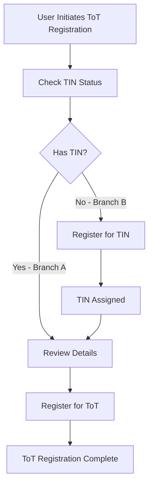
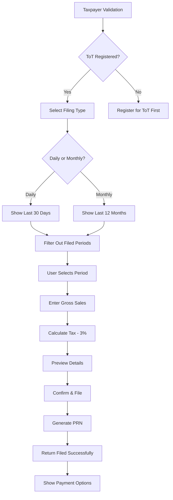

# ToT (Turnover Tax) Registration API Documentation

## Overview

The ToT Registration APIs support the WhatsApp-based Turnover Tax registration flow for Ghana Revenue Authority. The flow handles two scenarios:
- **Branch A**: Users who already have a TIN (Tax Identification Number)
- **Branch B**: Users who need to register for a TIN first before ToT registration

## Base URL

```
http://localhost:3000/api/v1/tot
```

## Authentication

Currently, these are mock APIs and do not require authentication. In production, these endpoints should be secured.

## Flow Diagram



## Endpoints

### 1. Check TIN Status

Check if a user has an existing TIN based on National ID and Year of Birth.

**Endpoint:** `POST /api/v1/tot/check-tin`

**Request Body:**
```json
{
  "nationalId": "22957832",
  "yearOfBirth": "1980"
}
```

**Response (User Has TIN - Branch A):**
```json
{
  "success": true,
  "hasTin": true,
  "tinNumber": "TIN12345678",
  "userDetails": {
    "firstName": "Kwame",
    "lastName": "Mensah",
    "nationalId": "22957832",
    "dateOfBirth": "1980-06-22"
  }
}
```

**Response (User Does NOT Have TIN - Branch B):**
```json
{
  "success": true,
  "hasTin": false,
  "message": "No TIN found for this user. Please register for a TIN first."
}
```

**Error Response (User Not Found):**
```json
{
  "success": false,
  "error": "User not found with provided National ID and Year of Birth"
}
```

---

### 2. Get User Details

Retrieve complete user details including TIN and ToT registration status.

**Endpoint:** `POST /api/v1/tot/get-user-details`

**Request Body:**
```json
{
  "nationalId": "22957832",
  "yearOfBirth": "1980"
}
```

**Response:**
```json
{
  "success": true,
  "found": true,
  "userDetails": {
    "firstName": "Kwame",
    "lastName": "Mensah",
    "nationalId": "22957832",
    "dateOfBirth": "1980-06-22",
    "tinNumber": "TIN12345678",
    "totRegistered": false,
    "totRegistrationDate": null
  }
}
```

**Error Response:**
```json
{
  "success": false,
  "found": false,
  "error": "User not found"
}
```

---

### 3. Register TIN (Branch B Flow)

Register a new TIN for a user who doesn't have one.

**Endpoint:** `POST /api/v1/tot/register-tin`

**Request Body:**
```json
{
  "nationalId": "27750418",
  "firstName": "Kwame",
  "yearOfBirth": "1989"
}
```

**Response:**
```json
{
  "success": true,
  "tinNumber": "TIN87654321",
  "message": "🎉 Congratulations! Your TIN has been created. Your TIN Number is: TIN87654321",
  "userDetails": {
    "firstName": "Kwame",
    "lastName": "Mensah",
    "nationalId": "27750418",
    "tinNumber": "TIN87654321"
  }
}
```

**Error Response (User Already Has TIN):**
```json
{
  "success": false,
  "error": "User already has a TIN",
  "tinNumber": "TIN12345678"
}
```

---

### 4. Register for ToT

Register a user for Turnover Tax. User must have a TIN before registering.

**Endpoint:** `POST /api/v1/tot/register-tot`

**Request Body:**
```json
{
  "nationalId": "22957832",
  "yearOfBirth": "1980"
}
```

**Response:**
```json
{
  "success": true,
  "message": "✅ Dear Kwame Mensah, Thank you! You're now registered for Turnover Tax (ToT). You can now file your daily or monthly returns anytime.",
  "userDetails": {
    "firstName": "Kwame",
    "lastName": "Mensah",
    "nationalId": "22957832",
    "tinNumber": "TIN12345678",
    "totRegistered": true,
    "totRegistrationDate": "2025-11-24T10:52:42.123Z"
  }
}
```

**Error Response (No TIN):**
```json
{
  "success": false,
  "error": "User must have a TIN before registering for ToT. Please register for TIN first."
}
```

**Error Response (Already Registered):**
```json
{
  "success": false,
  "error": "User is already registered for ToT",
  "registrationDate": "2025-11-24T10:52:42.123Z"
}
```

---

### 5. Get ToT Status

Check the ToT registration status for a user.

**Endpoint:** `POST /api/v1/tot/status`

**Request Body:**
```json
{
  "nationalId": "22957832",
  "yearOfBirth": "1980"
}
```

**Response:**
```json
{
  "success": true,
  "hasTin": true,
  "tinNumber": "TIN12345678",
  "totRegistered": true,
  "totRegistrationDate": "2025-11-24T10:52:42.123Z",
  "userDetails": {
    "firstName": "Kwame",
    "lastName": "Mensah",
    "nationalId": "22957832"
  }
}
```

---

## Complete Flow Examples

### Branch A: User with Existing TIN

```bash
# Step 1: Check TIN Status
curl -X POST http://localhost:3000/api/v1/tot/check-tin \
  -H "Content-Type: application/json" \
  -d '{"nationalId": "22957832", "yearOfBirth": "1980"}'

# Response: hasTin: true, tinNumber provided

# Step 2: Register for ToT
curl -X POST http://localhost:3000/api/v1/tot/register-tot \
  -H "Content-Type: application/json" \
  -d '{"nationalId": "22957832", "yearOfBirth": "1980"}'

# Response: success: true, ToT registration complete
```

### Branch B: User without TIN

```bash
# Step 1: Check TIN Status
curl -X POST http://localhost:3000/api/v1/tot/check-tin \
  -H "Content-Type: application/json" \
  -d '{"nationalId": "27750418", "yearOfBirth": "1989"}'

# Response: hasTin: false

# Step 2: Register for TIN
curl -X POST http://localhost:3000/api/v1/tot/register-tin \
  -H "Content-Type: application/json" \
  -d '{"nationalId": "27750418", "firstName": "Kwame", "yearOfBirth": "1989"}'

# Response: success: true, TIN assigned

# Step 3: Verify TIN was assigned
curl -X POST http://localhost:3000/api/v1/tot/check-tin \
  -H "Content-Type: application/json" \
  -d '{"nationalId": "27750418", "yearOfBirth": "1989"}'

# Response: hasTin: true, tinNumber provided

# Step 4: Register for ToT
curl -X POST http://localhost:3000/api/v1/tot/register-tot \
  -H "Content-Type: application/json" \
  -d '{"nationalId": "27750418", "yearOfBirth": "1989"}'

# Response: success: true, ToT registration complete
```

---

## Test Data

The mock API includes 50 test users:
- **Users with TIN (Branch A)**: First 25 users (e.g., "22957832", "2206083", "26256450")
- **Users without TIN (Branch B)**: Last 25 users (e.g., "27750418", "27607871", "25758371")

### Sample Users for Testing

**Branch A (Has TIN):**
- National ID: `22957832`, Year of Birth: `1980`
- National ID: `26256450`, Year of Birth: `1989`
- National ID: `20720990`, Year of Birth: `1977`

**Branch B (No TIN):**
- National ID: `27750418`, Year of Birth: `1989`
- National ID: `27607871`, Year of Birth: `1988`
- National ID: `25758371`, Year of Birth: `1988`

---

## Error Handling

All endpoints return consistent error responses:

### Validation Errors (400)
```json
{
  "success": false,
  "error": "National ID and Year of Birth are required"
}
```

### Not Found Errors (404)
```json
{
  "success": false,
  "error": "User not found with provided National ID and Year of Birth"
}
```

### Server Errors (500)
```json
{
  "success": false,
  "error": "Internal server error"
}
```

---

## Integration with WhatsApp Flow

These APIs are designed to be called from WhatsApp Flow screens:

1. **ToT Registration Screen** → Calls `POST /check-tin`
2. **TIN Registration Screen** (if needed) → Calls `POST /register-tin`
3. **ToT Registration Preview** → Calls `POST /register-tot`
4. **Status Check** → Calls `POST /status`

---

---

## Future Enhancements

When integrating with real backend services:

1. Replace mock data with database queries
2. Add authentication and authorization
3. Implement rate limiting
4. Add audit logging for all registration events
5. Integrate with actual GRA TIN and ToT registration systems
6. Add SMS/Email notifications for successful registrations
7. Implement data validation with National ID verification service

---

# ToT Filing & Payment API Documentation

## Overview

The ToT Filing & Payment APIs support the WhatsApp-based tax filing flow for registered ToT taxpayers. Users can file daily or monthly returns and receive Payment Reference Numbers (PRNs) for tax payments.

## Business Rules

- **ToT Tax Rate**: 3% of gross sales (calculated by backend)
- **Filing Types**: DAILY or MONTHLY
- **Duplicate Prevention**: Users can file only once per valid period
- **ToT Registration Required**: Users must be registered for ToT before filing
- **Period Management**: System tracks filed periods and prevents duplicates

## Filing Flow Diagram



---

## Filing Endpoints

### 6. Get Available Periods

Get list of available filing periods (unfiled periods only).

**Endpoint:** `POST /api/v1/tot/available-periods`

**Request Body:**
```json
{
  "nationalId": "22957832",
  "yearOfBirth": "1980",
  "filingType": "DAILY"
}
```

**Parameters:**
- `nationalId` (string, required): User's National ID
- `yearOfBirth` (string, required): Year of birth (4 digits)
- `filingType` (string, required): Either "DAILY" or "MONTHLY"

**Response (Daily):**
```json
{
  "success": true,
  "filingType": "DAILY",
  "periods": [
    "24 Nov 2025",
    "23 Nov 2025",
    "22 Nov 2025",
    "21 Nov 2025"
  ],
  "totalAvailable": 30
}
```

**Response (Monthly):**
```json
{
  "success": true,
  "filingType": "MONTHLY",
  "periods": [
    "November 2025",
    "October 2025",
    "September 2025"
  ],
  "totalAvailable": 12
}
```

**Error Response (Not Registered for ToT):**
```json
{
  "success": false,
  "error": "User is not registered for ToT. Please register first."
}
```

---

### 7. Calculate Tax

Calculate 3% tax on gross sales (preview before filing).

**Endpoint:** `POST /api/v1/tot/calculate-tax`

**Request Body:**
```json
{
  "grossSales": 5000
}
```

**Response:**
```json
{
  "success": true,
  "grossSales": 5000,
  "taxRate": 3,
  "taxDue": 150,
  "currency": "GHS"
}
```

**Error Response (Invalid Amount):**
```json
{
  "success": false,
  "error": "Gross Sales must be a positive number"
}
```

---

### 8. File Return

File a ToT return and receive Payment Reference Number (PRN).

**Endpoint:** `POST /api/v1/tot/file-return`

**Request Body:**
```json
{
  "nationalId": "22957832",
  "yearOfBirth": "1980",
  "grossSales": 5000,
  "filingType": "DAILY",
  "filingPeriod": "24 Nov 2025"
}
```

**Parameters:**
- `nationalId` (string, required): User's National ID
- `yearOfBirth` (string, required): Year of birth
- `grossSales` (number, required): Gross sales amount in GHS
- `filingType` (string, required): "DAILY" or "MONTHLY"
- `filingPeriod` (string, required): Exact period string (e.g., "24 Nov 2025" or "November 2025")

**Response:**
```json
{
  "success": true,
  "message": "✅ Dear Kwame Mensah, Your Turnover Tax return has been filed successfully.",
  "prn": "GRA-000001",
  "returnDetails": {
    "sellerName": "Kwame Mensah",
    "sellerTin": "TIN12345678",
    "grossSales": 5000,
    "filingPeriod": "24 Nov 2025",
    "filingType": "DAILY",
    "taxRate": 3,
    "taxDue": 150,
    "currency": "GHS",
    "prn": "GRA-000001",
    "filedAt": "2025-11-24T14:12:00.000Z",
    "paymentStatus": "PENDING"
  }
}
```

**Error Response (Duplicate Filing):**
```json
{
  "success": false,
  "error": "This period (24 Nov 2025) has already been filed. You can file only once per period."
}
```

**Error Response (Not Registered):**
```json
{
  "success": false,
  "error": "User is not registered for ToT. Please register first."
}
```

---

### 9. Get Filing History

Retrieve all filed returns for a user.

**Endpoint:** `POST /api/v1/tot/filing-history`

**Request Body:**
```json
{
  "nationalId": "22957832",
  "yearOfBirth": "1980"
}
```

**Response:**
```json
{
  "success": true,
  "totalFilings": 2,
  "filings": [
    {
      "id": "filing-1732456320123-abc123",
      "grossSales": 150000,
      "taxDue": 4500,
      "filingType": "MONTHLY",
      "filingPeriod": "November 2025",
      "prn": "GRA-000002",
      "filedAt": "2025-11-24T15:32:00.000Z",
      "paymentStatus": "PENDING"
    },
    {
      "id": "filing-1732456200456-xyz789",
      "grossSales": 5000,
      "taxDue": 150,
      "filingType": "DAILY",
      "filingPeriod": "24 Nov 2025",
      "prn": "GRA-000001",
      "filedAt": "2025-11-24T14:12:00.000Z",
      "paymentStatus": "PENDING"
    }
  ]
}
```

---

### 10. Get Return Details

Retrieve specific return details using Payment Reference Number (PRN).

**Endpoint:** `POST /api/v1/tot/return-details`

**Request Body:**
```json
{
  "prn": "GRA-000001"
}
```

**Response:**
```json
{
  "success": true,
  "found": true,
  "returnDetails": {
    "sellerName": "Kwame Mensah",
    "sellerTin": "TIN12345678",
    "nationalId": "22957832",
    "grossSales": 5000,
    "filingPeriod": "24 Nov 2025",
    "filingType": "DAILY",
    "taxRate": 3,
    "taxDue": 150,
    "currency": "GHS",
    "prn": "GRA-000001",
    "filedAt": "2025-11-24T14:12:00.000Z",
    "paymentStatus": "PENDING"
  }
}
```

**Error Response (PRN Not Found):**
```json
{
  "success": false,
  "found": false,
  "error": "Return not found with the provided PRN"
}
```

---

## Complete Filing Flow Examples

### Daily Filing Flow

```bash
# Step 1: Validate Taxpayer (use existing endpoint)
curl -X POST http://localhost:3000/api/v1/tot/get-user-details \
  -H "Content-Type: application/json" \
  -d '{"nationalId": "22957832", "yearOfBirth": "1980"}'

# Response: Check totRegistered: true

# Step 2: Get Available Daily Periods
curl -X POST http://localhost:3000/api/v1/tot/available-periods \
  -H "Content-Type: application/json" \
  -d '{
    "nationalId": "22957832",
    "yearOfBirth": "1980",
    "filingType": "DAILY"
  }'

# Response: List of available daily periods

# Step 3: Calculate Tax (Preview)
curl -X POST http://localhost:3000/api/v1/tot/calculate-tax \
  -H "Content-Type: application/json" \
  -d '{"grossSales": 5000}'

# Response: { taxDue: 150, taxRate: 3 }

# Step 4: File Return
curl -X POST http://localhost:3000/api/v1/tot/file-return \
  -H "Content-Type: application/json" \
  -d '{
    "nationalId": "22957832",
    "yearOfBirth": "1980",
    "grossSales": 5000,
    "filingType": "DAILY",
    "filingPeriod": "24 Nov 2025"
  }'

# Response: { success: true, prn: "GRA-000001", taxDue: 150 }

# Step 5: View Filing History
curl -X POST http://localhost:3000/api/v1/tot/filing-history \
  -H "Content-Type: application/json" \
  -d '{"nationalId": "22957832", "yearOfBirth": "1980"}'

# Response: List of all filed returns
```

### Monthly Filing Flow

```bash
# Step 1: Get Available Monthly Periods
curl -X POST http://localhost:3000/api/v1/tot/available-periods \
  -H "Content-Type: application/json" \
  -d '{
    "nationalId": "22957832",
    "yearOfBirth": "1980",
    "filingType": "MONTHLY"
  }'

# Response: List of available monthly periods

# Step 2: File Monthly Return
curl -X POST http://localhost:3000/api/v1/tot/file-return \
  -H "Content-Type: application/json" \
  -d '{
    "nationalId": "22957832",
    "yearOfBirth": "1980",
    "grossSales": 150000,
    "filingType": "MONTHLY",
    "filingPeriod": "November 2025"
  }'

# Response: { success: true, prn: "GRA-000002", taxDue: 4500 }
```

---

## Filing Integration with WhatsApp Flow

The filing APIs integrate with WhatsApp Flow screens as follows:

1. **Taxpayer Validation Screen** → Calls `POST /get-user-details`
2. **Filing Type Selection** → User chooses DAILY or MONTHLY
3. **Period Selection Screen** → Calls `POST /available-periods`
4. **Sales Entry Screen** → User enters gross sales
5. **Preview Screen** → Calls `POST /calculate-tax` to show tax calculation
6. **Confirmation** → Calls `POST /file-return` to submit
7. **Success Screen** → Shows PRN and payment options

---

## Period Format Reference

### Daily Periods
- Format: `DD MMM YYYY` (e.g., "24 Nov 2025")
- Generated: Last 30 days from current date
- Example: "24 Nov 2025", "23 Nov 2025", "22 Nov 2025"

### Monthly Periods
- Format: `MMMM YYYY` (e.g., "November 2025")
- Generated: Last 12 months from current month
- Example: "November 2025", "October 2025", "September 2025"

---

## Payment Reference Numbers (PRN)

- **Format**: `GRA-XXXXXX` (6-digit sequential number)
- **Examples**: GRA-000001, GRA-000002, GRA-000003
- **Uniqueness**: Each filed return gets a unique PRN
- **Usage**: Used for payment processing and return lookup

---

## Notes

- All mock data is stored in memory and will reset when the server restarts
- TIN numbers are auto-generated in the format `TINxxxxxxxx`
- Year of Birth extracted from `dateOfBirth` field for matching
- All endpoints use POST method for security (no sensitive data in URLs)
- Filing records persist in-memory during server session
- PRN counter resets when server restarts
- Tax calculation rounds to 2 decimal places
