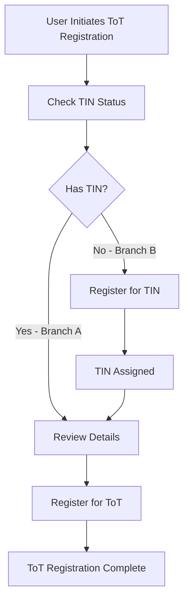

# ToT (Turnover Tax) Registration API Documentation

## Overview

The ToT Registration APIs support the WhatsApp-based Turnover Tax registration flow for Ghana Revenue Authority. The flow handles two scenarios:
- **Branch A**: Users who already have a TIN (Tax Identification Number)
- **Branch B**: Users who need to register for a TIN first before ToT registration

## Base URL

```
http://localhost:3000/api/v1/tot
```

## Authentication

Currently, these are mock APIs and do not require authentication. In production, these endpoints should be secured.

## Flow Diagram



## Endpoints

### 1. Check TIN Status

Check if a user has an existing TIN based on National ID and Year of Birth.

**Endpoint:** `POST /api/v1/tot/check-tin`

**Request Body:**
```json
{
  "nationalId": "22957832",
  "yearOfBirth": "1980"
}
```

**Response (User Has TIN - Branch A):**
```json
{
  "success": true,
  "hasTin": true,
  "tinNumber": "TIN12345678",
  "userDetails": {
    "firstName": "Kwame",
    "lastName": "Mensah",
    "nationalId": "22957832",
    "dateOfBirth": "1980-06-22"
  }
}
```

**Response (User Does NOT Have TIN - Branch B):**
```json
{
  "success": true,
  "hasTin": false,
  "message": "No TIN found for this user. Please register for a TIN first."
}
```

**Error Response (User Not Found):**
```json
{
  "success": false,
  "error": "User not found with provided National ID and Year of Birth"
}
```

---

### 2. Get User Details

Retrieve complete user details including TIN and ToT registration status.

**Endpoint:** `POST /api/v1/tot/get-user-details`

**Request Body:**
```json
{
  "nationalId": "22957832",
  "yearOfBirth": "1980"
}
```

**Response:**
```json
{
  "success": true,
  "found": true,
  "userDetails": {
    "firstName": "Kwame",
    "lastName": "Mensah",
    "nationalId": "22957832",
    "dateOfBirth": "1980-06-22",
    "tinNumber": "TIN12345678",
    "totRegistered": false,
    "totRegistrationDate": null
  }
}
```

**Error Response:**
```json
{
  "success": false,
  "found": false,
  "error": "User not found"
}
```

---

### 3. Register TIN (Branch B Flow)

Register a new TIN for a user who doesn't have one.

**Endpoint:** `POST /api/v1/tot/register-tin`

**Request Body:**
```json
{
  "nationalId": "27750418",
  "firstName": "Kwame",
  "yearOfBirth": "1989"
}
```

**Response:**
```json
{
  "success": true,
  "tinNumber": "TIN87654321",
  "message": "🎉 Congratulations! Your TIN has been created. Your TIN Number is: TIN87654321",
  "userDetails": {
    "firstName": "Kwame",
    "lastName": "Mensah",
    "nationalId": "27750418",
    "tinNumber": "TIN87654321"
  }
}
```

**Error Response (User Already Has TIN):**
```json
{
  "success": false,
  "error": "User already has a TIN",
  "tinNumber": "TIN12345678"
}
```

---

### 4. Register for ToT

Register a user for Turnover Tax. User must have a TIN before registering.

**Endpoint:** `POST /api/v1/tot/register-tot`

**Request Body:**
```json
{
  "nationalId": "22957832",
  "yearOfBirth": "1980"
}
```

**Response:**
```json
{
  "success": true,
  "message": "✅ Dear Kwame Mensah, Thank you! You're now registered for Turnover Tax (ToT). You can now file your daily or monthly returns anytime.",
  "userDetails": {
    "firstName": "Kwame",
    "lastName": "Mensah",
    "nationalId": "22957832",
    "tinNumber": "TIN12345678",
    "totRegistered": true,
    "totRegistrationDate": "2025-11-24T10:52:42.123Z"
  }
}
```

**Error Response (No TIN):**
```json
{
  "success": false,
  "error": "User must have a TIN before registering for ToT. Please register for TIN first."
}
```

**Error Response (Already Registered):**
```json
{
  "success": false,
  "error": "User is already registered for ToT",
  "registrationDate": "2025-11-24T10:52:42.123Z"
}
```

---

### 5. Get ToT Status

Check the ToT registration status for a user.

**Endpoint:** `POST /api/v1/tot/status`

**Request Body:**
```json
{
  "nationalId": "22957832",
  "yearOfBirth": "1980"
}
```

**Response:**
```json
{
  "success": true,
  "hasTin": true,
  "tinNumber": "TIN12345678",
  "totRegistered": true,
  "totRegistrationDate": "2025-11-24T10:52:42.123Z",
  "userDetails": {
    "firstName": "Kwame",
    "lastName": "Mensah",
    "nationalId": "22957832"
  }
}
```

---

## Complete Flow Examples

### Branch A: User with Existing TIN

```bash
# Step 1: Check TIN Status
curl -X POST http://localhost:3000/api/v1/tot/check-tin \
  -H "Content-Type: application/json" \
  -d '{"nationalId": "22957832", "yearOfBirth": "1980"}'

# Response: hasTin: true, tinNumber provided

# Step 2: Register for ToT
curl -X POST http://localhost:3000/api/v1/tot/register-tot \
  -H "Content-Type: application/json" \
  -d '{"nationalId": "22957832", "yearOfBirth": "1980"}'

# Response: success: true, ToT registration complete
```

### Branch B: User without TIN

```bash
# Step 1: Check TIN Status
curl -X POST http://localhost:3000/api/v1/tot/check-tin \
  -H "Content-Type: application/json" \
  -d '{"nationalId": "27750418", "yearOfBirth": "1989"}'

# Response: hasTin: false

# Step 2: Register for TIN
curl -X POST http://localhost:3000/api/v1/tot/register-tin \
  -H "Content-Type: application/json" \
  -d '{"nationalId": "27750418", "firstName": "Kwame", "yearOfBirth": "1989"}'

# Response: success: true, TIN assigned

# Step 3: Verify TIN was assigned
curl -X POST http://localhost:3000/api/v1/tot/check-tin \
  -H "Content-Type: application/json" \
  -d '{"nationalId": "27750418", "yearOfBirth": "1989"}'

# Response: hasTin: true, tinNumber provided

# Step 4: Register for ToT
curl -X POST http://localhost:3000/api/v1/tot/register-tot \
  -H "Content-Type: application/json" \
  -d '{"nationalId": "27750418", "yearOfBirth": "1989"}'

# Response: success: true, ToT registration complete
```

---

## Test Data

The mock API includes 50 test users:
- **Users with TIN (Branch A)**: First 25 users (e.g., "22957832", "2206083", "26256450")
- **Users without TIN (Branch B)**: Last 25 users (e.g., "27750418", "27607871", "25758371")

### Sample Users for Testing

**Branch A (Has TIN):**
- National ID: `22957832`, Year of Birth: `1980`
- National ID: `26256450`, Year of Birth: `1989`
- National ID: `20720990`, Year of Birth: `1977`

**Branch B (No TIN):**
- National ID: `27750418`, Year of Birth: `1989`
- National ID: `27607871`, Year of Birth: `1988`
- National ID: `25758371`, Year of Birth: `1988`

---

## Error Handling

All endpoints return consistent error responses:

### Validation Errors (400)
```json
{
  "success": false,
  "error": "National ID and Year of Birth are required"
}
```

### Not Found Errors (404)
```json
{
  "success": false,
  "error": "User not found with provided National ID and Year of Birth"
}
```

### Server Errors (500)
```json
{
  "success": false,
  "error": "Internal server error"
}
```

---

## Integration with WhatsApp Flow

These APIs are designed to be called from WhatsApp Flow screens:

1. **ToT Registration Screen** → Calls `POST /check-tin`
2. **TIN Registration Screen** (if needed) → Calls `POST /register-tin`
3. **ToT Registration Preview** → Calls `POST /register-tot`
4. **Status Check** → Calls `POST /status`

---

## Future Enhancements

When integrating with real backend services:

1. Replace mock data with database queries
2. Add authentication and authorization
3. Implement rate limiting
4. Add audit logging for all registration events
5. Integrate with actual GRA TIN and ToT registration systems
6. Add SMS/Email notifications for successful registrations
7. Implement data validation with National ID verification service

---

## Notes

- All mock data is stored in memory and will reset when the server restarts
- TIN numbers are auto-generated in the format `TINxxxxxxxx`
- Year of Birth extracted from `dateOfBirth` field for matching
- All endpoints use POST method for security (no sensitive data in URLs)
