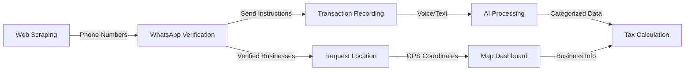

# Ghana Revenue Authority - Technical Documentation Overview

## What This System Does

This system helps the Ghana Revenue Authority identify and register informal businesses by:

1. **Finding businesses** through web scraping and social media
2. **Mapping their locations** using GPS and geospatial clustering
3. **Automating tax records** using AI to process voice notes and text messages

Think of it as a three-stage pipeline:

```
STAGE 1: DISCOVERY          STAGE 2: MAPPING           STAGE 3: AUTOMATION
┌──────────────┐           ┌──────────────┐           ┌──────────────┐
│ Find         │           │ Locate       │           │ Track        │
│ Businesses   │──────────▶│ Businesses   │──────────▶│ Transactions │
│ Online       │           │ on Map       │           │ via WhatsApp │
└──────────────┘           └──────────────┘           └──────────────┘
```

## The Three Components

### Part 3: OSINT & Social Media Identification
**What it does:** Finds informal businesses by scraping websites and validating phone numbers

**Input:** Search queries (e.g., "hair salon in Madina")  
**Output:** 20-30 verified businesses with phone numbers

### Part 4: Geospatial Mapping System
**What it does:** Maps businesses on an interactive map and identifies market clusters

**Input:** GPS coordinates from scraping + WhatsApp location shares  
**Output:** Interactive map showing business locations and market hotspots

### Part 5: AI/ML Automation
**What it does:** Converts voice notes to text and automatically categorizes transactions

**Input:** WhatsApp voice messages (e.g., "Sold rice for 250 cedis")  
**Output:** Structured transaction records (Income: Sales, 250 GHS)

## How They Work Together



## Key Technologies Used

| Component | Primary Tools | Purpose |
|-----------|--------------|---------|
| **Web Scraping** | Puppeteer, Cheerio | Extract business data from websites |
| **Phone Validation** | libphonenumber-js | Verify Ghana phone numbers |
| **WhatsApp** | WhatsApp Business API | Communicate with businesses |
| **Mapping** | Leaflet.js, PostGIS | Display and analyze locations |
| **Voice-to-Text** | Google Speech-to-Text | Convert audio to text |
| **Transaction Processing** | Regex + Keywords | Categorize income/expenses |
| **Database** | PostgreSQL | Store all data |

## Expected Results

- **20-30 verified businesses** identified and mapped
- **80%+ GPS coverage** of identified businesses
- **95%+ accuracy** in transaction categorization
- **Interactive dashboard** for tax officers to view and manage businesses

---

**Next Steps:** Read the detailed documentation for each component to understand the specific data flows and transformations.
