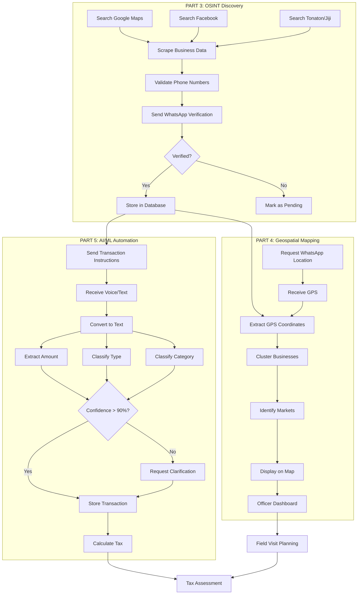

# Complete System Flow: From Discovery to Tax Calculation

This document shows how all three parts work together in a complete end-to-end flow.

## The Complete Journey



## Real-World Example: Ama's Beauty Salon

Let's follow one business through the entire system:

### Stage 1: Discovery (Part 3)

**Week 1: Finding the Business**

1. **Scraping**
   - System searches Google Maps: "beauty salon in Madina"
   - Finds: "Ama's Beauty Salon"
   - Extracts: Phone: 0244123456, Address: Madina Market, GPS: (5.6837, -0.1965)

2. **Validation**
   - Phone number validated: +233244123456 (MTN)
   - Carrier: MTN
   - Status: Valid ✅

3. **Verification**
   - WhatsApp message sent: "Reply YES if you operate a business"
   - Ama replies: "YES"
   - Status: Verified ✅
   - Confidence score: 0.87 (high)

**Result:** Ama's Beauty Salon added to database

---

### Stage 2: Mapping (Part 4)

**Week 2: Locating the Business**

1. **GPS Collection**
   - OSINT data already has GPS: (5.6837, -0.1965)
   - WhatsApp message: "Please share your business location"
   - Ama shares location via WhatsApp
   - Confirmed GPS: (5.6837, -0.1965) ✅

2. **Clustering**
   - System finds 22 other businesses within 500m
   - Creates cluster: "Madina Market"
   - Cluster properties:
     - Center: (5.6837, -0.1965)
     - Radius: 450m
     - Business count: 23
     - Density: 36.2 businesses/km²

3. **Map Display**
   - Green marker appears on officer dashboard
   - Popup shows: Ama's Beauty Salon, Verified, Hairdressing
   - Blue circle shows Madina Market cluster

**Result:** Ama's salon mapped and clustered

---

### Stage 3: Transaction Tracking (Part 5)

**Week 3-4: Recording Transactions**

**Day 1:**
- Ama sends voice: 🎤 "Customer paid 120 cedis for haircut"
- System transcribes: "Customer paid 120 cedis for haircut"
- Extracts: Amount = 120
- Classifies: Type = Income, Category = Sales
- Confidence: 95%
- Stores: Income - Sales - 120 GHS
- Confirms: "✅ Recorded: Income - Sales - 120 GHS"

**Day 2:**
- Ama types: "Bought hair products 200"
- Extracts: Amount = 200
- Classifies: Type = Expense, Category = Supplies
- Confidence: 95%
- Stores: Expense - Supplies - 200 GHS
- Confirms: "✅ Recorded: Expense - Supplies - 200 GHS"

**Day 3:**
- Ama sends voice: 🎤 "Paid rent"
- System transcribes: "Paid rent"
- Extracts: Amount = None ⚠️
- Classifies: Type = Expense, Category = Rent
- Confidence: 50% (missing amount)
- Asks: "Please reply with the amount in cedis"
- Ama replies: "500"
- Stores: Expense - Rent - 500 GHS
- Confirms: "✅ Recorded: Expense - Rent - 500 GHS"

**Week 4 Summary:**
- Total Income: 2,450 GHS (18 transactions)
- Total Expenses: 1,680 GHS (12 transactions)
- Net Profit: 770 GHS
- Ready for tax calculation

**Result:** Complete transaction history for tax assessment

---

## Data Flow Across All Parts

### Database Tables

```sql
-- From Part 3
businesses
├─ id: 1
├─ business_name: "Ama's Beauty Salon"
├─ phone_international: "+233244123456"
├─ category: "hairdressing"
├─ confidence_score: 0.87
└─ verification_status: "verified"

-- From Part 4
business_locations
├─ business_id: 1
├─ location: POINT(-0.1965 5.6837)
├─ cluster_id: 5
└─ location_type: "whatsapp"

market_clusters
├─ id: 5
├─ cluster_name: "Madina Market"
├─ business_count: 23
└─ density_score: 36.2

-- From Part 5
transactions
├─ business_id: 1
├─ transaction_type: "income"
├─ category: "sales"
├─ amount: 120.00
├─ confidence_score: 0.95
└─ verified: true
```

### API Endpoints Used

**Part 3:**
- `POST /api/scrape/google-maps` - Trigger scraping
- `POST /api/validate/phone` - Validate phone number
- `POST /webhook/whatsapp` - Receive verification

**Part 4:**
- `GET /api/map/businesses` - Get all businesses for map
- `GET /api/map/clusters` - Get market clusters
- `POST /api/location/update` - Update business location

**Part 5:**
- `POST /webhook/whatsapp` - Receive transactions
- `POST /api/transaction/categorize` - Categorize transaction
- `GET /api/transaction/summary` - Get business summary

## Officer Dashboard View

**What the tax officer sees:**

### Map Tab
- 📍 Green marker at Madina Market
- 🔵 Blue circle showing cluster of 23 businesses
- 📊 Popup: "Ama's Beauty Salon - Verified - Hairdressing"
- 📱 Button: "Send WhatsApp" | "View Transactions"

### Business Details Tab
```
Ama's Beauty Salon
━━━━━━━━━━━━━━━━━━━━━━━━━━━━━━━━━━
📞 Phone: 0244123456 (MTN)
📍 Location: Madina Market, Accra
🏢 Type: Hairdressing
✅ Status: Verified
📊 Confidence: 87%
🗺️ Market: Madina Market (23 businesses)

Transaction Summary (Last 30 Days)
━━━━━━━━━━━━━━━━━━━━━━━━━━━━━━━━━━
💰 Total Income: 2,450 GHS (18 transactions)
💸 Total Expenses: 1,680 GHS (12 transactions)
📈 Net Profit: 770 GHS

Top Categories:
  Sales: 2,450 GHS
  Supplies: 980 GHS
  Rent: 500 GHS
  Utilities: 200 GHS
```

### Transactions Tab
```
Date       Type     Category   Amount    Source
━━━━━━━━━━━━━━━━━━━━━━━━━━━━━━━━━━━━━━━━━━━
Nov 19    Income   Sales      120 GHS   Voice
Nov 18    Expense  Supplies   200 GHS   Text
Nov 17    Expense  Rent       500 GHS   Voice
Nov 16    Income   Sales      150 GHS   Voice
...
```

## Success Metrics Across All Parts

### Part 3: OSINT
- ✅ 20-30 verified businesses
- ✅ 70-80% valid phone numbers
- ✅ 40-50% WhatsApp verification rate
- ✅ Average confidence: 0.75+

### Part 4: Geospatial
- ✅ 80%+ GPS coverage
- ✅ 2-5 market clusters identified
- ✅ Interactive map with filters
- ✅ Offline support for officers

### Part 5: AI/ML
- ✅ 95%+ categorization accuracy
- ✅ 90%+ voice-to-text accuracy
- ✅ <2 second processing time
- ✅ <10% clarification rate

## Timeline: From Zero to Tax Assessment

**Week 1: Discovery**
- Day 1-2: Set up scraping tools
- Day 3-4: Scrape Google Maps, Facebook, Tonaton
- Day 5-6: Validate phone numbers
- Day 7: Send WhatsApp verifications

**Week 2: Mapping**
- Day 1-2: Collect GPS coordinates
- Day 3-4: Run clustering algorithm
- Day 5-6: Build officer dashboard
- Day 7: Test offline functionality

**Week 3-4: Transaction Tracking**
- Day 1: Send transaction instructions
- Day 2-14: Collect transactions via WhatsApp
- Day 15-20: Review and verify data
- Day 21: Generate tax assessment

**Total: 4 weeks from start to tax calculation**

## Cost Breakdown

**Part 3: OSINT**
- Proxy service (optional): $20/month
- WhatsApp API: $0 (free tier)
- **Total: ~$20**

**Part 4: Geospatial**
- OpenStreetMap tiles: Free
- PostGIS hosting: $10/month
- **Total: ~$10**

**Part 5: AI/ML**
- Google Speech-to-Text: $4 (1000 transactions)
- Server hosting: $15/month
- **Total: ~$19**

**Grand Total: ~$50 for PoC**

## Next Steps

1. **Deploy Part 3** → Start identifying businesses
2. **Deploy Part 4** → Map verified businesses
3. **Deploy Part 5** → Enable transaction tracking
4. **Train Officers** → Dashboard usage and field operations
5. **Pilot Test** → 5-10 businesses for 2 weeks
6. **Scale Up** → Expand to more regions

## Key Takeaways

✅ **Integrated System:** All three parts work together seamlessly  
✅ **WhatsApp-First:** Businesses use familiar tools  
✅ **Automated:** Minimal manual data entry  
✅ **Accurate:** 95%+ accuracy in categorization  
✅ **Affordable:** ~$50 for proof of concept  
✅ **Scalable:** Can expand to thousands of businesses  
✅ **Officer-Friendly:** Mobile dashboard with offline support  
✅ **Privacy-Focused:** Encrypted data, minimal retention  

This system transforms informal business identification and tax collection from a manual, paper-based process into an automated, data-driven operation.
