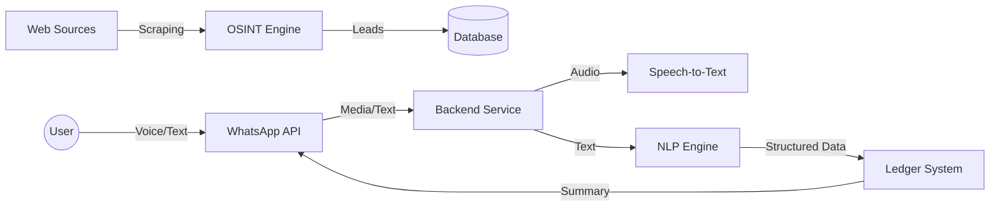

# 1-Week POC Implementation Guide: GRA Informal Sector Tax System

## Executive Summary
The technical implementation plan for a 1-week Proof of Concept (POC) designed to automate the identification of informal businesses and simplify tax compliance through AI-assisted bookkeeping.

**Objective**: Demonstrate a working end-to-end flow from "identifying a potential taxpayer" to "taxpayer recording a transaction via WhatsApp".

**Core Components**:
1.  **Business Identification (OSINT)**: Automated discovery of informal businesses.
2.  **WhatsApp Interface**: Natural language interaction for transaction recording.
3.  **Bookkeeping Engine**: Automated categorization and ledger maintenance.

---

## 1. Architecture Overview

### High-Level Data Flow

### Technology Stack
-   **Backend Runtime**: Node.js (v18+)
-   **Database**: PostgreSQL (for structured ledger and OSINT leads)
-   **Messaging**: WhatsApp Business API (Existing Setup)
-   **AI Services**:
    -   **STT**: Google Cloud Speech-to-Text (or OpenAI Whisper)
    -   **NLP**: Custom Keyword/Regex Engine (Low latency, high accuracy for POC)
-   **Scraping**: Puppeteer (Headless Chrome)

---

## 2. Component 1: Business Identification (OSINT)

**Goal**: Generate a list of 20+ potential informal businesses in a specific target area (e.g., Madina, Accra).

### 2.1 Scraping Strategy
We will target public digital footprints where informal businesses advertise.

*   **Source A: Google Maps**
    *   **Target**: "Tailors", "Salons", "Mechanics", "Chop Bars" in [Target Location].
    *   **Data Points**: Name, Phone Number, GPS Coordinates, Review Count (proxy for activity).
    *   **Tool**: Puppeteer script to scroll and extract data from search results.

*   **Source B: Facebook Public Pages (Optional)**
    *   **Target**: Public pages with local phone numbers.
    *   **Method**: Search for keywords + "+233" phone numbers.

### 2.2 Validation Pipeline
Raw scraped data must be cleaned to be actionable.

1.  **Phone Normalization**: Convert all formats (024-..., +233...) to E.164 format (`+233...`) using `libphonenumber-js`.
2.  **Deduplication**: Remove duplicate numbers across sources.
3.  **Scoring**: Assign a "Confidence Score" (0.0 - 1.0) based on data completeness (Name + Phone + Location = High Score).

### 2.3 Output Artifact
A JSON or CSV file containing "Leads" ready for the onboarding team or automated WhatsApp outreach.

---

## 3. Component 2: Text & Voice Flows (WhatsApp)

**Goal**: Enable a user to record a transaction in < 10 seconds using natural language.

### 3.1 Integration
*   **Webhook**: Endpoint to receive real-time message notifications.
*   **Media Handling**:
    *   **Text**: Process immediately.
    *   **Voice**:
        1.  Receive `audio` message type.
        2.  Download OGG/AAC file using WhatsApp Media API.
        3.  Convert to WAV/MP3 (using `ffmpeg`).
        4.  Send to STT Service.

### 3.2 Flow Design

#### Flow A: Income Recording (Voice)
> **User (Audio)**: "I sold 5 bags of rice for 450 cedis."
1.  **STT**: Transcribes to text.
2.  **NLP**: Detects intent `INCOME` and entities `Amount: 450`, `Item: Rice`.
3.  **Bot**: "✅ Recorded: Sales - 450 GHS. Is this correct?"
4.  **User**: "Yes"
5.  **System**: Saves to Ledger.

#### Flow B: Expense Recording (Text)
> **User (Text)**: "Transport 20"
1.  **NLP**: Detects intent `EXPENSE` and entities `Amount: 20`, `Category: Transport`.
2.  **Bot**: "✅ Recorded: Transport - 20 GHS."

---

## 4. Component 3: Basic Bookkeeping & Ledger

**Goal**: Maintain a double-entry standard ledger without exposing complexity to the user.

### 4.1 Data Model (Schema)
**Table: `transactions`**
| Column | Type | Description |
| :--- | :--- | :--- |
| `id` | UUID | Unique ID |
| `user_phone` | VARCHAR | User identifier |
| `type` | ENUM | `INCOME` or `EXPENSE` |
| `category` | VARCHAR | e.g., "Sales", "Transport", "Utilities" |
| `amount` | DECIMAL | Transaction value |
| `raw_text` | TEXT | Original user input (for audit) |
| `created_at` | TIMESTAMP | Transaction time |

### 4.2 Categorization Logic
A simple rule-based engine will be used for the POC to ensure predictability.

*   **Income Keywords**: "sold", "sale", "received", "payment", "customer"
*   **Expense Keywords**: "bought", "paid", "transport", "fare", "credit", "airtime", "food"
*   **Default**: If unsure, categorize as "Uncategorized" and ask user to clarify.

### 4.3 Reporting
**Daily Summary**:
A scheduled job (or user-triggered command "Report") calculates:
`Profit = Sum(Income) - Sum(Expense)`

> **Bot Response**:
> "📊 *Daily Summary*
> Income: 450 GHS
> Expenses: 20 GHS
> *Profit: 430 GHS*"

---

## 5. Implementation Timeline (1 Week)

| Day | Focus Area | Key Tasks |
| :--- | :--- | :--- |
| **Day 1** | **Setup & OSINT** | Init project, setup DB, build Google Maps scraper. |
| **Day 2** | **WhatsApp Integration** | Connect webhook to existing API, handle text messages. |
| **Day 3** | **Voice Pipeline** | Implement media download, ffmpeg conversion, and STT integration. |
| **Day 4** | **NLP & Ledger** | Build keyword classifier, setup database schema, implement "Record" logic. |
| **Day 5** | **Reporting & Polish** | Implement Daily Summary, error handling, and end-to-end testing. |
| **Day 6** | **Demo Prep** | Load sample data, verify flows, prepare demo script. |
| **Day 7** | **Buffer** | Final bug fixes and documentation. |

---

## 6. Success Criteria for POC
1.  **OSINT**: List of 20+ real businesses in a test locality.
2.  **Voice**: Successfully transcribe and understand a Ghanaian-accented voice note (English).
3.  **Ledger**: Correctly calculate profit from a mix of 5 income/expense messages.
