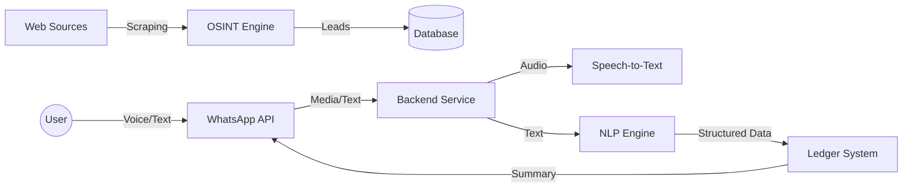

# 1-Week POC Implementation Guide: GRA Informal Sector Tax System

## Summary
The technical implementation plan for a 1-week Proof of Concept (POC) designed to automate the identification of informal businesses and simplify tax compliance through AI-assisted bookkeeping.

**Objective**: Demonstrate a working end-to-end flow from "identifying a potential taxpayer" to "taxpayer recording a transaction via WhatsApp".

**Core Components**:
1.  **Business Identification (OSINT)**: Automated discovery of informal businesses.
2.  **WhatsApp Interface**: Natural language interaction for transaction recording.
3.  **Bookkeeping Engine**: Automated categorization and ledger maintenance.
4.  **ToT Tax System**: Registration and filing for Turnover Tax (3% of gross sales).

---

## POC Status Update 

### ✅ Completed Components

#### 1. Database Schema & Models
- ✅ User model with business information
- ✅ Transaction model with double-entry support
- ✅ Lead model for OSINT data
- ✅ Transaction types: INCOME, EXPENSE, TAX
- ✅ Prisma ORM integration

#### 2. ToT Registration & Filing APIs (11 Endpoints)
**Purpose**: Enable taxpayers to register for Turnover Tax via WhatsApp

**Registration Flow (5 endpoints)**:
- ✅ `POST /api/v1/tot/check-tin` - Check if user has TIN
- ✅ `POST /api/v1/tot/get-user-details` - Get complete user info
- ✅ `POST /api/v1/tot/register-tin` - Register new TIN (Branch B flow)
- ✅ `POST /api/v1/tot/register-tot` - Register for ToT
- ✅ `POST /api/v1/tot/status` - Get ToT registration status

**Filing & Payment Flow (5 endpoints)**:
- ✅ `POST /api/v1/tot/available-periods` - Get unfiled periods (daily/monthly)
- ✅ `POST /api/v1/tot/calculate-tax` - Calculate 3% tax on gross sales
- ✅ `POST /api/v1/tot/file-return` - File return + generate PRN
- ✅ `POST /api/v1/tot/filing-history` - Get all filed returns
- ✅ `POST /api/v1/tot/return-details` - Get return details by PRN

**Features**:
- ✅ Mock data service with 50 test users
- ✅ TIN generation (format: TINxxxxxxxx)
- ✅ Duplicate filing prevention
- ✅ PRN generation (format: GRA-XXXXXX)
- ✅ Period management (last 30 days for daily, 12 months for monthly)
- ✅ 3% tax calculation
- ✅ Payment status tracking (Ongoing/PAID)

#### 3. OSINT Lead Generation System
**Purpose**: Automated discovery of informal businesses from Google Maps

**Services**:
- ✅ **Scraper Service** (`scraper.service.ts`) - Puppeteer-based Google Maps scraper
- ✅ **Phone Validator** (`phone-validator.service.ts`) - Ghana phone validation & normalization
- ✅ **Classifier Service** (`classifier.service.ts`) - Business categorization & confidence scoring

**Controllers & Routes**:
- ✅ `POST /api/v1/osint/scrape` - Trigger Google Maps scraping
- ✅ `GET /api/v1/osint/leads` - Get scraped leads with filtering

**Features**:
- ✅ Google Maps scraping for multiple business types (salons, chop bars, tailors, mechanics)
- ✅ Phone number extraction and E.164 normalization
- ✅ GPS coordinates extraction
- ✅ Duplicate detection
- ✅ Confidence scoring (0.0-1.0) based on data completeness
- ✅ Category classification with keyword matching
- ✅ Pagination support for leads

#### 4. Transaction Recording & Bookkeeping
**Purpose**: AI-powered transaction extraction from text/voice

**Services**:
- ✅ **Audio Service** (`audio.service.ts`) - Audio download, base64 conversion, cleanup
- ✅ **Gemini Integration** - Multimodal LLM for audio/text → transaction extraction

**Controllers & Routes**:
- ✅ `POST /api/v1/workflow/process-input` - Process text or audio for transaction extraction
- ✅ `POST /api/v1/workflow/confirm-transaction` - Save confirmed transaction to ledger

**Features**:
- ✅ Gemini 2.0 Flash for AI extraction
- ✅ Intent classification (INCOME, EXPENSE, TAX)
- ✅ Entity extraction (amount, category, item, units)
- ✅ Audio file handling (download from URL, base64 encoding)
- ✅ Confirmation workflow before saving
- ✅ Raw text storage for audit trail

#### 5. Reporting & Analytics
**Controllers  & Routes**:
- ✅ `GET /api/v1/reports/:userId/daily-summary` - Daily profit/loss calculation
- ✅ `GET /api/v1/reports/:userId/transactions` - List last 50 transactions

**Features**:
- ✅ Daily income/expense summaries
- ✅ Net profit calculation
- ✅ Transaction history with pagination

#### 6. Authentication & User Management
**Controllers & Routes**:
- ✅ `POST /api/v1/auth/register` - Register new user
- ✅ `GET /api/v1/auth/:userId` - Get user profile
- ✅ `PATCH /api/v1/auth/:userId` - Update user profile
- ✅ `GET /api/v1/auth/phone/:phoneNumber` - Get user by phone

#### 7. Infrastructure
- ✅ Node.js + TypeScript backend
- ✅ PostgreSQL database with Prisma
- ✅ Express.js REST API
- ✅ Environment configuration
- ✅ CORS and middleware setup
- ✅ Gemini AI integration
- ✅ Puppeteer for web scraping

#### 8. Documentation & Testing
- ✅ ToT API documentation (`TOT_API_DOCUMENTATION.md`)
- ✅ ToT quick reference (`TOT_API_QUICK_REFERENCE.md`)
- ✅ OSINT cURL commands (`OSINT_CURL_COMMANDS.md`)
- ✅ Postman collection - GRA POC API (`GRA_POC_API.postman_collection.json`)
- ✅ Postman collection - ToT API (`ToT_API.postman_collection.json`)

#### 9. Taxpayer Education Module
**Purpose**: Send educational materials to users about tax compliance and benefits

**Completed**:
- ✅ Educational content on tax matters created
- ✅ Tax compliance guides
- ✅ Benefits of registration materials

**Ongoing**:
- ⏳ WhatsApp delivery mechanism
- ⏳ Content scheduling system
- ⏳ User engagement tracking

**Status**: 🟡 **Partial** (Content ready, WhatsApp integration Ongoing)

### 🚧 Ongoing for POC

#### 1. WhatsApp Integration
- ⏳ WhatsApp Flow JSON for ToT registration
- ⏳ WhatsApp Flow JSON for ToT filing
- ⏳ WhatsApp Flow JSON for transaction recording
- ⏳ Educational content delivery system
- ⏳ Content scheduling and engagement tracking

### 📊 POC Completion Status

| Component | Status | Progress |
|-----------|--------|----------|
| Database Schema | ✅ Complete | 100% |
| User Authentication APIs | ✅ Complete | 100% |
| ToT Registration APIs | ✅ Complete | 100% |
| ToT Filing APIs | ✅ Complete | 100% |
| OSINT Lead Generation | ✅ Complete | 100% |
| Transaction Recording (Gemini) | ✅ Complete | 100% |
| Audio Processing | ✅ Complete | 100% |
| Reporting APIs | ✅ Complete | 100% |
| Documentation & Postman | ✅ Complete | 100% |
| Taxpayer Education Module | 🟡 Partial | 60% |
| WhatsApp Integration | ⏳ Ongoing |

**Overall POC Progress**: 

### 🎯 Next Steps

1. **Test End-to-End Flows**
   - ToT registration via WhatsApp
   - ToT filing via WhatsApp (Daily & Monthly)
   - Transaction recording via text
   - Transaction recording via voice
   - Generate daily summary

### 💡 WhatsApp Flow Assumption

**Assumed User Journey**:
1. User prompts GRA
2. User taps "Register for ToT" button
3. WhatsApp Flow opens with registration screens
4. User enters National ID + Year of Birth
5. System checks TIN → Routes to Branch A or B
6. User registers for ToT
7. User can now file returns
8. User selects filing type (Daily/Monthly)
9. System shows available periods
10. User enters gross sales
11. System calculates 3% tax and shows preview
12. User confirms and files return
13. System generates PRN for payment
14. User sees payment options

**Current Status**: Backend APIs ready , WhatsApp intergration ongoing

---

## 1. Architecture Overview

### High-Level Data Flow

### Technology Stack
-   **Backend Runtime**: Node.js (v18+)
-   **Database**: PostgreSQL (for structured ledger and OSINT leads)
-   **Messaging**: WhatsApp Business API (Existing Setup)
-   **AI Services**:
    -   **NLP**: Google Gemini
-   **Scraping**: Puppeteer (Headless Chrome)

---

## 2. Component 1: Business Identification (OSINT)

**Goal**: Generate a list of 20+ potential informal businesses in a specific target area (e.g., Madina, Accra).

### 2.1 Scraping Strategy
We will target public digital footprints where informal businesses advertise.

*   **Source A: Google Maps**
    *   **Target**: "Tailors", "Salons", "Mechanics", "Chop Bars" in [Target Location].
    *   **Data Points**: Name, Phone Number, GPS Coordinates, Review Count (proxy for activity).
    *   **Tool**: Puppeteer script to scroll and extract data from search results.

*   **Source B: Facebook Public Pages (Optional)**
    *   **Target**: Public pages with local phone numbers.
    *   **Method**: Search for keywords + "+233" phone numbers.

### 2.2 Validation Pipeline
Raw scraped data must be cleaned to be actionable.

1.  **Phone Normalization**: Convert all formats (024-..., +233...) to E.164 format (`+233...`) using `libphonenumber-js`.
2.  **Deduplication**: Remove duplicate numbers across sources.
3.  **Scoring**: Assign a "Confidence Score" (0.0 - 1.0) based on data completeness (Name + Phone + Location = High Score).

### 2.3 Output Artifact
A JSON or CSV file containing "Leads" ready for the onboarding team or automated WhatsApp outreach.

---

## 3. Component 2: Text & Voice Flows (WhatsApp)

**Goal**: Enable a user to record a transaction in < 10 seconds using natural language.

### 3.1 Integration
*   **Webhook**: Endpoint to receive real-time message notifications.
*   **Media Handling**:
    *   **Text**: Process immediately.
    *   **Voice**:
        1.  Receive `audio` message type.
        2.  Download OGG/AAC file using WhatsApp Media API.
        3.  Convert to WAV/MP3 (using `ffmpeg`).
        4.  Send to STT Service.

### 3.2 Flow Design

#### Flow A: Income Recording (Voice)
> **User (Audio)**: "I sold 5 bags of rice for 450 cedis."
1.  **STT**: Transcribes to text.
2.  **NLP**: Detects intent `INCOME` and entities `Amount: 450`, `Item: Rice`.
3.  **Bot**: "✅ Recorded: Sales - 450 GHS. Is this correct?"
4.  **User**: "Yes"
5.  **System**: Saves to Ledger.

#### Flow B: Expense Recording (Text)
> **User (Text)**: "Transport 20"
1.  **NLP**: Detects intent `EXPENSE` and entities `Amount: 20`, `Category: Transport`.
2.  **Bot**: "✅ Recorded: Transport - 20 GHS."

---

## 4. Component 3: Basic Bookkeeping & Ledger

**Goal**: Maintain a double-entry standard ledger without exposing complexity to the user.

### 4.1 Data Model (Schema)
**Table: `transactions`**
| Column | Type | Description |
| :--- | :--- | :--- |
| `id` | UUID | Unique ID |
| `user_phone` | VARCHAR | User identifier |
| `type` | ENUM | `INCOME` or `EXPENSE` |
| `category` | VARCHAR | e.g., "Sales", "Transport", "Utilities" |
| `amount` | DECIMAL | Transaction value |
| `raw_text` | TEXT | Original user input (for audit) |
| `created_at` | TIMESTAMP | Transaction time |

### 4.2 Categorization Logic
A simple rule-based engine will be used for the POC to ensure predictability.

*   **Income Keywords**: "sold", "sale", "received", "payment", "customer"
*   **Expense Keywords**: "bought", "paid", "transport", "fare", "credit", "airtime", "food"
*   **Default**: If unsure, categorize as "Uncategorized" and ask user to clarify.

### 4.3 Reporting
**Daily Summary**:
A scheduled job (or user-triggered command "Report") calculates:
`Profit = Sum(Income) - Sum(Expense)`

> **Bot Response**:
> "📊 *Daily Summary*
> Income: 450 GHS
> Expenses: 20 GHS
> *Profit: 430 GHS*"

---

## 5. Implementation Timeline

| Day | Focus Area | Key Tasks |
| :--- | :--- | :--- |
| 1 | **Setup & OSINT** | Init project, setup DB, build Google Maps scraper. |
| 2 | **WhatsApp Integration** | Connect webhook to existing API, handle text messages. |
| 3 | **Voice Pipeline** | Implement media download, ffmpeg conversion, and STT integration. |
| 4 | **NLP & Ledger** | Build keyword classifier, setup database schema, implement "Record" logic. |
| 5 | **Reporting & Polish** | Implement Daily Summary, error handling, and end-to-end testing. |
| 6 | **Demo Prep** | Load sample data, verify flows, prepare demo script. |
| 7 | **Buffer** | Final bug fixes and documentation. |

---

## 6. Success Criteria for POC
1.  **OSINT**: List of 20+ real businesses in a test locality.
2.  **Voice**: Successfully transcribe and understand a Ghanaian-accented voice note (English).
3.  **Ledger**: Correctly calculate profit from a mix of 5 income/expense messages.
