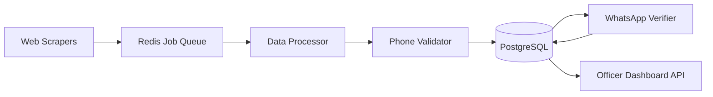

# TECHNICAL IMPLEMENTATION GUIDE #3 — OSINT & SOCIAL MEDIA IDENTIFICATION

## 1. System Overview
**Goal**: Identify 20-30 informal businesses in Ghana using web scraping, phone validation, and WhatsApp verification.

**Tech Stack**:
- **Scraping**: Puppeteer (headless Chrome) + Cheerio (HTML parsing)
- **Phone Validation**: libphonenumber-js
- **WhatsApp**: WhatsApp Business API (Cloud API)
- **Database**: PostgreSQL with PostGIS extension
- **Backend**: Node.js with Express
- **Queue System**: Bull (Redis-based job queue)

---

## 2. Data Pipeline Architecture



---

## 3. Component 1: Google Maps Scraper

### 3.1 Tool Selection
- **Primary**: Puppeteer v21+ (headless Chrome automation)
- **Alternative**: Apify Google Maps Scraper (if budget allows)
- **Parsing**: Cheerio for HTML extraction

### 3.2 Implementation Steps

**Step 1: Setup Puppeteer**
```javascript
// Install: npm install puppeteer cheerio
const puppeteer = require('puppeteer');
```

**Step 2: Target URL Pattern**
```
https://www.google.com/maps/search/{BUSINESS_TYPE}+in+{LOCATION}
Example: https://www.google.com/maps/search/hair+salon+in+Madina+Accra
```

**Step 3: Scraping Logic**
1. Launch headless browser
2. Navigate to search URL
3. Scroll to load lazy-loaded results (simulate user scroll)
4. Extract business cards using CSS selectors:
   - Business name: `div.fontHeadlineSmall`
   - Phone: `button[data-item-id^="phone:"]`
   - Address: `button[data-item-id^="address:"]`
   - GPS: Extract from URL parameter `@{lat},{lng}`

**Step 4: Data Structure**
```json
{
  "source": "google_maps",
  "business_name": "Ama's Beauty Salon",
  "phone_raw": "0244 123 456",
  "address": "Madina Market, Accra",
  "gps_lat": 5.6837,
  "gps_lng": -0.1965,
  "category": "Beauty Salon",
  "scraped_at": "2025-11-19T10:30:00Z",
  "url": "https://maps.google.com/?cid=12345"
}
```

**Step 5: Rate Limiting**
- Max 10 requests/minute to avoid Google blocking
- Use residential proxies (BrightData or Smartproxy) if IP gets blocked
- Rotate user agents

**Step 6: Storage**
- Save raw JSON to PostgreSQL table `osint_raw_data`
- Queue phone validation job

### 3.3 Target Search Queries
| Business Type | Location | Expected Results |
|---------------|----------|------------------|
| hair salon | Madina, Accra | 50-100 |
| chop bar | Kaneshie, Accra | 30-60 |
| tailor shop | Kumasi Central | 40-80 |
| phone repair | Osu, Accra | 20-40 |

---

## 4. Component 2: Facebook Marketplace Scraper

### 4.1 Tool Selection
- **Primary**: Puppeteer with Facebook login session
- **Challenge**: Facebook actively blocks scrapers
- **Alternative**: Manual export of Marketplace seller data (PoC fallback)

### 4.2 Implementation Steps

**Step 1: Authentication**
- Use Facebook Graph API with Business Account (requires approval)
- OR: Use cookie-based session from logged-in browser

**Step 2: Target URL Pattern**
```
https://www.facebook.com/marketplace/{CITY}/search?query={PRODUCT}
Example: https://www.facebook.com/marketplace/accra/search?query=food
```

**Step 3: Data Extraction**
- Seller name: `a[aria-label*="profile"]`
- Product type: `span.marketplace-title`
- Location: `span.marketplace-location`
- Contact: Click "Message" button → Extract phone if available

**Step 4: Data Structure**
```json
{
  "source": "facebook_marketplace",
  "seller_name": "Kwame's Food Delivery",
  "product_type": "Prepared Food",
  "location": "Madina",
  "phone_raw": "0201234567",
  "profile_url": "https://facebook.com/kwame.food",
  "scraped_at": "2025-11-19T11:00:00Z"
}
```

**Step 5: Limitations**
- Facebook may require manual CAPTCHA solving
- For PoC: Limit to 50 profiles max
- Use Apify Facebook Marketplace Scraper (paid) for production

---

## 5. Component 3: Tonaton/Jiji Scraper

### 5.1 Tool Selection
- **Primary**: Axios + Cheerio (simple HTML scraping)
- **Reason**: These sites don't use heavy JavaScript rendering

### 5.2 Implementation Steps

**Step 1: Target URLs**
```
Tonaton: https://tonaton.com/en/ads/ghana/{CATEGORY}
Jiji: https://jiji.com.gh/{CATEGORY}
```

**Step 2: HTTP Request**
```javascript
const axios = require('axios');
const cheerio = require('cheerio');

const response = await axios.get('https://tonaton.com/en/ads/ghana/services');
const $ = cheerio.load(response.data);
```

**Step 3: CSS Selectors**
- Business name: `.ad-title`
- Phone: `.phone-number` (often hidden, requires click simulation)
- Location: `.location-tag`
- Category: `.category-breadcrumb`

**Step 4: Data Structure**
```json
{
  "source": "tonaton",
  "business_name": "Kofi's Plumbing Services",
  "phone_raw": "0277654321",
  "location": "Tema",
  "category": "Services",
  "ad_url": "https://tonaton.com/ad/12345",
  "scraped_at": "2025-11-19T12:00:00Z"
}
```

---

## 6. Component 4: Phone Number Validation

### 6.1 Tool Selection
- **Library**: `libphonenumber-js` (Google's phone number library)
- **Install**: `npm install libphonenumber-js`

### 6.2 Implementation Steps

**Step 1: Parse Phone Number**
```javascript
const { parsePhoneNumber } = require('libphonenumber-js');

const phone = parsePhoneNumber('0244123456', 'GH');
// Output: +233244123456
```

**Step 2: Validation Rules**
```javascript
function validateGhanaPhone(rawPhone) {
  try {
    const phone = parsePhoneNumber(rawPhone, 'GH');
    
    // Check if valid
    if (!phone.isValid()) return null;
    
    // Check carrier prefix
    const number = phone.nationalNumber;
    const prefix = number.substring(0, 3);
    
    const carriers = {
      '024': 'MTN', '054': 'MTN', '055': 'MTN', '059': 'MTN',
      '020': 'Vodafone', '050': 'Vodafone',
      '027': 'AirtelTigo', '057': 'AirtelTigo', '026': 'AirtelTigo'
    };
    
    if (!carriers[prefix]) return null;
    
    return {
      international: phone.number, // +233244123456
      national: phone.nationalNumber, // 0244123456
      carrier: carriers[prefix],
      valid: true
    };
  } catch (error) {
    return null;
  }
}
```

**Step 3: Deduplication**
```sql
-- PostgreSQL query to check for duplicates
SELECT COUNT(*) FROM businesses 
WHERE phone_international = '+233244123456';
```

**Step 4: Database Schema**
```sql
CREATE TABLE businesses (
  id SERIAL PRIMARY KEY,
  source VARCHAR(50),
  business_name VARCHAR(255),
  phone_raw VARCHAR(50),
  phone_international VARCHAR(20) UNIQUE,
  phone_national VARCHAR(20),
  carrier VARCHAR(20),
  location VARCHAR(255),
  gps_lat DECIMAL(10, 8),
  gps_lng DECIMAL(11, 8),
  category VARCHAR(100),
  confidence_score DECIMAL(3, 2),
  verification_status VARCHAR(20) DEFAULT 'pending',
  scraped_at TIMESTAMP,
  verified_at TIMESTAMP,
  created_at TIMESTAMP DEFAULT NOW()
);

CREATE INDEX idx_phone ON businesses(phone_international);
CREATE INDEX idx_status ON businesses(verification_status);
```

---

## 7. Component 5: Business Type Classification

### 7.1 Tool Selection
- **Approach**: Keyword matching with regex
- **Library**: Native JavaScript String methods

### 7.2 Implementation Steps

**Step 1: Keyword Dictionary**
```javascript
const businessCategories = {
  'hairdressing': {
    keywords: ['hair', 'salon', 'beauty', 'barber', 'braiding', 'weave'],
    priority: 1
  },
  'food_services': {
    keywords: ['chop bar', 'restaurant', 'food', 'catering', 'eatery', 'kitchen'],
    priority: 1
  },
  'tailoring': {
    keywords: ['tailor', 'sewing', 'fashion', 'dressmaking', 'seamstress'],
    priority: 1
  },
  'electronics_repair': {
    keywords: ['phone repair', 'electronics', 'laptop', 'computer', 'technician'],
    priority: 2
  },
  'transport': {
    keywords: ['taxi', 'driver', 'transport', 'delivery', 'uber', 'bolt'],
    priority: 2
  },
  'retail': {
    keywords: ['shop', 'store', 'provisions', 'supermarket', 'boutique'],
    priority: 3
  }
};
```

**Step 2: Classification Logic**
```javascript
function classifyBusiness(businessName, category) {
  const text = (businessName + ' ' + category).toLowerCase();
  
  let matches = [];
  
  for (const [type, config] of Object.entries(businessCategories)) {
    for (const keyword of config.keywords) {
      if (text.includes(keyword)) {
        matches.push({ type, priority: config.priority, keyword });
        break;
      }
    }
  }
  
  // Return highest priority match
  if (matches.length === 0) return { type: 'other', confidence: 0.3 };
  
  matches.sort((a, b) => a.priority - b.priority);
  return {
    type: matches[0].type,
    confidence: 0.85,
    matched_keyword: matches[0].keyword
  };
}
```

---

## 8. Component 6: WhatsApp Verification

### 8.1 Tool Selection
- **API**: WhatsApp Business Cloud API (Meta)
- **Provider**: 360dialog or Twilio WhatsApp API
- **Webhook**: Express.js endpoint

### 8.2 Setup Steps

**Step 1: Register with Meta**
1. Create Facebook Business Account
2. Create WhatsApp Business App at developers.facebook.com
3. Get Phone Number ID and Access Token
4. Set up webhook URL: `https://yourdomain.com/webhook/whatsapp`

**Step 2: Send Verification Message**
```javascript
const axios = require('axios');

async function sendWhatsAppVerification(phoneNumber, businessName) {
  const WHATSAPP_TOKEN = process.env.WHATSAPP_ACCESS_TOKEN;
  const PHONE_NUMBER_ID = process.env.WHATSAPP_PHONE_NUMBER_ID;
  
  const message = {
    messaging_product: 'whatsapp',
    to: phoneNumber, // +233244123456
    type: 'template',
    template: {
      name: 'business_verification', // Pre-approved template
      language: { code: 'en' },
      components: [
        {
          type: 'body',
          parameters: [
            { type: 'text', text: businessName }
          ]
        },
        {
          type: 'button',
          sub_type: 'quick_reply',
          index: 0,
          parameters: [
            { type: 'payload', payload: 'YES' }
          ]
        },
        {
          type: 'button',
          sub_type: 'quick_reply',
          index: 1,
          parameters: [
            { type: 'payload', payload: 'STOP' }
          ]
        }
      ]
    }
  };
  
  const response = await axios.post(
    `https://graph.facebook.com/v18.0/${PHONE_NUMBER_ID}/messages`,
    message,
    {
      headers: {
        'Authorization': `Bearer ${WHATSAPP_TOKEN}`,
        'Content-Type': 'application/json'
      }
    }
  );
  
  return response.data;
}
```

**Step 3: Message Template (Pre-approve with Meta)**
```
Hello {{1}},

Ghana Revenue Authority is identifying informal businesses for simplified tax registration.

Reply YES if you operate a business.
Reply STOP to opt out.

This is confidential and secure.
```

**Step 4: Webhook Handler**
```javascript
app.post('/webhook/whatsapp', async (req, res) => {
  const message = req.body.entry[0].changes[0].value.messages[0];
  
  const from = message.from; // +233244123456
  const text = message.text.body.toUpperCase();
  
  if (text === 'YES') {
    // Update database
    await db.query(
      `UPDATE businesses 
       SET verification_status = 'verified', 
           verified_at = NOW() 
       WHERE phone_international = $1`,
      [from]
    );
    
    // Send confirmation
    await sendWhatsAppMessage(from, '✅ Thank you! Your business has been verified.');
  } else if (text === 'STOP') {
    await db.query(
      `UPDATE businesses 
       SET verification_status = 'opted_out' 
       WHERE phone_international = $1`,
      [from]
    );
  }
  
  res.sendStatus(200);
});
```

---

## 9. Component 7: Confidence Scoring

### 9.1 Scoring Algorithm

```javascript
function calculateConfidenceScore(business) {
  let score = 0;
  
  // Data source weight
  const sourceWeights = {
    'google_maps': 0.40,
    'facebook_marketplace': 0.30,
    'tonaton': 0.25,
    'jiji': 0.25,
    'whatsapp_business': 0.45
  };
  score += sourceWeights[business.source] || 0.20;
  
  // Phone validation
  if (business.phone_valid) score += 0.20;
  
  // GPS coordinates present
  if (business.gps_lat && business.gps_lng) score += 0.10;
  
  // WhatsApp verification
  if (business.verification_status === 'verified') score += 0.30;
  
  // Business name quality (not generic)
  if (business.business_name.length > 5 && 
      !business.business_name.includes('N/A')) {
    score += 0.05;
  }
  
  return Math.min(score, 1.0); // Cap at 1.0
}
```

### 9.2 Thresholds
```javascript
function getBusinessStatus(confidenceScore) {
  if (confidenceScore >= 0.80) return 'auto_approved';
  if (confidenceScore >= 0.60) return 'manual_review';
  return 'rejected';
}
```

---

## 10. Job Queue System

### 10.1 Tool Selection
- **Queue**: Bull (Redis-based)
- **Install**: `npm install bull redis`

### 10.2 Implementation

**Step 1: Define Jobs**
```javascript
const Queue = require('bull');

const scrapingQueue = new Queue('scraping', {
  redis: { host: 'localhost', port: 6379 }
});

const validationQueue = new Queue('validation', {
  redis: { host: 'localhost', port: 6379 }
});

const whatsappQueue = new Queue('whatsapp', {
  redis: { host: 'localhost', port: 6379 }
});
```

**Step 2: Add Jobs**
```javascript
// Scraping job
await scrapingQueue.add('google_maps', {
  searchQuery: 'hair salon in Madina',
  location: 'Accra'
}, {
  attempts: 3,
  backoff: { type: 'exponential', delay: 2000 }
});

// Validation job
await validationQueue.add('validate_phone', {
  businessId: 123,
  phoneRaw: '0244123456'
});

// WhatsApp job
await whatsappQueue.add('send_verification', {
  businessId: 123,
  phone: '+233244123456',
  businessName: "Ama's Beauty Salon"
}, {
  delay: 60000 // Wait 1 minute before sending
});
```

**Step 3: Process Jobs**
```javascript
scrapingQueue.process('google_maps', async (job) => {
  const results = await scrapeGoogleMaps(job.data.searchQuery);
  
  // Queue validation for each result
  for (const business of results) {
    await validationQueue.add('validate_phone', { business });
  }
  
  return { scraped: results.length };
});

validationQueue.process('validate_phone', async (job) => {
  const validated = validateGhanaPhone(job.data.business.phone_raw);
  
  if (validated) {
    // Save to database
    const businessId = await saveToDatabase(job.data.business, validated);
    
    // Queue WhatsApp verification
    await whatsappQueue.add('send_verification', {
      businessId,
      phone: validated.international,
      businessName: job.data.business.business_name
    });
  }
});
```

---

## 11. Database Queries

### 11.1 Get Businesses for Officer Dashboard
```sql
SELECT 
  id,
  business_name,
  phone_national,
  location,
  gps_lat,
  gps_lng,
  category,
  confidence_score,
  verification_status,
  source
FROM businesses
WHERE confidence_score >= 0.60
  AND verification_status != 'opted_out'
ORDER BY confidence_score DESC, verified_at DESC
LIMIT 50;
```

### 11.2 Get Verification Statistics
```sql
SELECT 
  verification_status,
  COUNT(*) as count,
  AVG(confidence_score) as avg_confidence
FROM businesses
GROUP BY verification_status;
```

---

## 12. Deployment Checklist

- [ ] Set up PostgreSQL database with schema
- [ ] Set up Redis for job queues
- [ ] Configure WhatsApp Business API credentials
- [ ] Set up proxy service (BrightData/Smartproxy)
- [ ] Deploy Express.js backend to cloud (AWS/GCP/Heroku)
- [ ] Set up webhook endpoint with HTTPS
- [ ] Configure environment variables
- [ ] Test scraping with 5 businesses
- [ ] Test phone validation
- [ ] Test WhatsApp verification flow
- [ ] Monitor job queue dashboard (Bull Board)

---

## 13. Expected Output

**Target**: 20-30 verified businesses

**Sample Database Record**:
```json
{
  "id": 1,
  "source": "google_maps",
  "business_name": "Ama's Beauty Salon",
  "phone_raw": "0244 123 456",
  "phone_international": "+233244123456",
  "phone_national": "0244123456",
  "carrier": "MTN",
  "location": "Madina Market, Accra",
  "gps_lat": 5.6837,
  "gps_lng": -0.1965,
  "category": "hairdressing",
  "confidence_score": 0.87,
  "verification_status": "verified",
  "scraped_at": "2025-11-19T10:30:00Z",
  "verified_at": "2025-11-19T11:15:00Z",
  "created_at": "2025-11-19T10:30:00Z"
}
```
