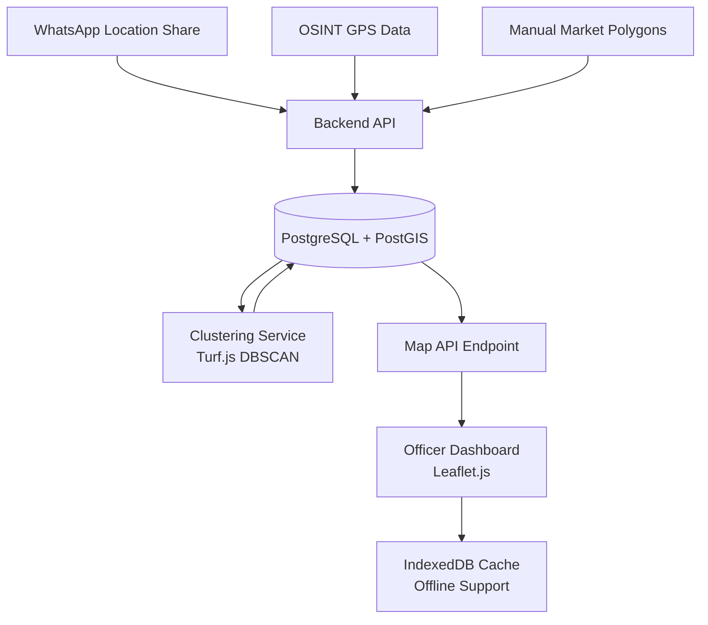

# TECHNICAL IMPLEMENTATION GUIDE #4 — GEOSPATIAL MAPPING SYSTEM

## 1. System Overview
**Goal**: Map informal businesses using GPS coordinates, create market clusters, and provide an interactive officer dashboard.

**Tech Stack**:
- **Mapping Library**: Leaflet.js v1.9+
- **Tile Provider**: OpenStreetMap (free)
- **Clustering**: Turf.js (geospatial analysis)
- **Database**: PostgreSQL with PostGIS extension
- **Backend**: Node.js with Express
- **Frontend**: React.js with react-leaflet
- **Offline Storage**: IndexedDB (via localforage)

---

## 2. System Architecture



---

## 3. Component 1: Database Setup with PostGIS

### 3.1 Install PostGIS Extension

```sql
-- Enable PostGIS extension
CREATE EXTENSION IF NOT EXISTS postgis;
CREATE EXTENSION IF NOT EXISTS postgis_topology;
```

### 3.2 Business Locations Table

```sql
CREATE TABLE business_locations (
  id SERIAL PRIMARY KEY,
  business_id INTEGER REFERENCES businesses(id),
  location_type VARCHAR(20), -- 'whatsapp', 'osint', 'manual'
  location GEOGRAPHY(POINT, 4326), -- PostGIS geography type
  address TEXT,
  market_name VARCHAR(255),
  cluster_id INTEGER,
  accuracy_meters INTEGER, -- GPS accuracy
  collected_at TIMESTAMP DEFAULT NOW(),
  created_at TIMESTAMP DEFAULT NOW()
);

-- Spatial index for fast queries
CREATE INDEX idx_location_gist ON business_locations USING GIST(location);
CREATE INDEX idx_cluster ON business_locations(cluster_id);
```

### 3.3 Market Clusters Table

```sql
CREATE TABLE market_clusters (
  id SERIAL PRIMARY KEY,
  cluster_name VARCHAR(255),
  center_point GEOGRAPHY(POINT, 4326),
  radius_meters INTEGER,
  business_count INTEGER DEFAULT 0,
  density_score DECIMAL(5, 2), -- businesses per km²
  created_at TIMESTAMP DEFAULT NOW(),
  updated_at TIMESTAMP DEFAULT NOW()
);

CREATE INDEX idx_cluster_location ON market_clusters USING GIST(center_point);
```

### 3.4 Predefined Market Boundaries

```sql
CREATE TABLE known_markets (
  id SERIAL PRIMARY KEY,
  market_name VARCHAR(255) UNIQUE,
  boundary GEOGRAPHY(POLYGON, 4326),
  center_point GEOGRAPHY(POINT, 4326),
  estimated_traders INTEGER,
  region VARCHAR(100),
  created_at TIMESTAMP DEFAULT NOW()
);

-- Insert known markets
INSERT INTO known_markets (market_name, center_point, estimated_traders, region) VALUES
  ('Makola Market', ST_GeogFromText('POINT(-0.1870 5.6037)'), 10000, 'Greater Accra'),
  ('Madina Market', ST_GeogFromText('POINT(-0.1965 5.6837)'), 5000, 'Greater Accra'),
  ('Kaneshie Market', ST_GeogFromText('POINT(-0.2372 5.5553)'), 8000, 'Greater Accra'),
  ('Kumasi Central Market', ST_GeogFromText('POINT(-1.6244 6.6885)'), 12000, 'Ashanti');
```

---

## 4. Component 2: WhatsApp Location Collection

### 4.1 WhatsApp Location Message Handler

```javascript
// Webhook handler for location messages
app.post('/webhook/whatsapp', async (req, res) => {
  const message = req.body.entry[0].changes[0].value.messages[0];
  
  if (message.type === 'location') {
    const location = message.location;
    const from = message.from; // +233244123456
    
    // Extract GPS coordinates
    const lat = location.latitude;  // e.g., 5.6837
    const lng = location.longitude; // e.g., -0.1965
    const address = location.address || null;
    const name = location.name || null;
    
    // Find business by phone number
    const business = await db.query(
      'SELECT id FROM businesses WHERE phone_international = $1',
      [from]
    );
    
    if (business.rows.length > 0) {
      // Save location to database
      await db.query(`
        INSERT INTO business_locations 
        (business_id, location_type, location, address, collected_at)
        VALUES ($1, $2, ST_GeogFromText($3), $4, NOW())
      `, [
        business.rows[0].id,
        'whatsapp',
        `POINT(${lng} ${lat})`, // Note: PostGIS uses lng, lat order
        address || name
      ]);
      
      // Send confirmation
      await sendWhatsAppMessage(from, 
        '✅ Location received! Thank you for sharing your business location.'
      );
      
      // Trigger clustering update
      await clusteringQueue.add('update_clusters', { region: 'Greater Accra' });
    }
  }
  
  res.sendStatus(200);
});
```

### 4.2 Request Location Flow

```javascript
async function requestBusinessLocation(phone, businessName) {
  const message = {
    messaging_product: 'whatsapp',
    to: phone,
    type: 'text',
    text: {
      body: `Hello ${businessName},\n\nTo complete your registration, please share your business location using the 📎 attachment button → Location.\n\nThis helps us serve you better.`
    }
  };
  
  await axios.post(
    `https://graph.facebook.com/v18.0/${PHONE_NUMBER_ID}/messages`,
    message,
    { headers: { 'Authorization': `Bearer ${WHATSAPP_TOKEN}` } }
  );
}
```

---

## 5. Component 3: OSINT GPS Data Import

### 5.1 Import from Scraping Results

```javascript
async function importOSINTLocations() {
  // Get businesses with GPS from scraping
  const businesses = await db.query(`
    SELECT id, gps_lat, gps_lng, location, source
    FROM businesses
    WHERE gps_lat IS NOT NULL 
      AND gps_lng IS NOT NULL
      AND id NOT IN (
        SELECT business_id FROM business_locations WHERE location_type = 'osint'
      )
  `);
  
  for (const biz of businesses.rows) {
    await db.query(`
      INSERT INTO business_locations 
      (business_id, location_type, location, address, collected_at)
      VALUES ($1, $2, ST_GeogFromText($3), $4, NOW())
    `, [
      biz.id,
      'osint',
      `POINT(${biz.gps_lng} ${biz.gps_lat})`,
      biz.location
    ]);
  }
  
  console.log(`Imported ${businesses.rows.length} OSINT locations`);
}
```

---

## 6. Component 4: Clustering Algorithm (DBSCAN)

### 6.1 Install Turf.js

```bash
npm install @turf/turf
```

### 6.2 Clustering Implementation

```javascript
const turf = require('@turf/turf');

async function clusterBusinesses(region = null) {
  // Fetch all business locations
  let query = `
    SELECT 
      bl.id,
      bl.business_id,
      ST_X(bl.location::geometry) as lng,
      ST_Y(bl.location::geometry) as lat
    FROM business_locations bl
    JOIN businesses b ON bl.business_id = b.id
    WHERE bl.cluster_id IS NULL
  `;
  
  if (region) {
    query += ` AND b.region = '${region}'`;
  }
  
  const locations = await db.query(query);
  
  // Convert to GeoJSON points
  const points = turf.featureCollection(
    locations.rows.map(loc => 
      turf.point([loc.lng, loc.lat], { 
        id: loc.id, 
        business_id: loc.business_id 
      })
    )
  );
  
  // DBSCAN parameters
  const maxDistance = 0.5; // 500 meters in kilometers
  const minPoints = 10;    // Minimum 10 businesses to form cluster
  
  // Perform clustering
  const clustered = turf.clustersDbscan(points, maxDistance, { minPoints });
  
  // Process clusters
  const clusterMap = {};
  clustered.features.forEach(feature => {
    const clusterId = feature.properties.cluster;
    if (clusterId !== undefined && clusterId !== -1) { // -1 = noise/outlier
      if (!clusterMap[clusterId]) {
        clusterMap[clusterId] = [];
      }
      clusterMap[clusterId].push(feature);
    }
  });
  
  // Save clusters to database
  for (const [clusterId, features] of Object.entries(clusterMap)) {
    // Calculate cluster center
    const centerPoint = turf.center(turf.featureCollection(features));
    const [lng, lat] = centerPoint.geometry.coordinates;
    
    // Calculate cluster radius
    const distances = features.map(f => 
      turf.distance(centerPoint, f, { units: 'meters' })
    );
    const radius = Math.max(...distances);
    
    // Insert cluster
    const clusterResult = await db.query(`
      INSERT INTO market_clusters 
      (cluster_name, center_point, radius_meters, business_count, density_score)
      VALUES ($1, ST_GeogFromText($2), $3, $4, $5)
      RETURNING id
    `, [
      `Cluster ${clusterId}`,
      `POINT(${lng} ${lat})`,
      Math.round(radius),
      features.length,
      calculateDensity(features.length, radius)
    ]);
    
    const dbClusterId = clusterResult.rows[0].id;
    
    // Update business locations with cluster_id
    const businessLocationIds = features.map(f => f.properties.id);
    await db.query(`
      UPDATE business_locations
      SET cluster_id = $1
      WHERE id = ANY($2)
    `, [dbClusterId, businessLocationIds]);
  }
  
  return Object.keys(clusterMap).length;
}

function calculateDensity(businessCount, radiusMeters) {
  const areaKm2 = Math.PI * Math.pow(radiusMeters / 1000, 2);
  return (businessCount / areaKm2).toFixed(2);
}
```

### 6.3 Identify Market Names

```javascript
async function identifyMarketNames() {
  // Match clusters to known markets
  const clusters = await db.query(`
    SELECT id, center_point
    FROM market_clusters
    WHERE cluster_name LIKE 'Cluster%'
  `);
  
  for (const cluster of clusters.rows) {
    // Find nearest known market within 1km
    const nearestMarket = await db.query(`
      SELECT market_name
      FROM known_markets
      WHERE ST_DWithin(center_point, $1, 1000)
      ORDER BY ST_Distance(center_point, $1)
      LIMIT 1
    `, [cluster.center_point]);
    
    if (nearestMarket.rows.length > 0) {
      await db.query(`
        UPDATE market_clusters
        SET cluster_name = $1
        WHERE id = $2
      `, [nearestMarket.rows[0].market_name, cluster.id]);
    }
  }
}
```

---

## 7. Component 5: Map API Endpoints

### 7.1 Get All Business Locations

```javascript
app.get('/api/map/businesses', async (req, res) => {
  const { region, status, businessType } = req.query;
  
  let query = `
    SELECT 
      b.id,
      b.business_name,
      b.phone_national,
      b.category,
      b.verification_status,
      b.confidence_score,
      ST_X(bl.location::geometry) as lng,
      ST_Y(bl.location::geometry) as lat,
      bl.address,
      mc.cluster_name as market_name
    FROM businesses b
    JOIN business_locations bl ON b.id = bl.business_id
    LEFT JOIN market_clusters mc ON bl.cluster_id = mc.id
    WHERE 1=1
  `;
  
  const params = [];
  let paramIndex = 1;
  
  if (region) {
    query += ` AND b.region = $${paramIndex}`;
    params.push(region);
    paramIndex++;
  }
  
  if (status) {
    query += ` AND b.verification_status = $${paramIndex}`;
    params.push(status);
    paramIndex++;
  }
  
  if (businessType) {
    query += ` AND b.category = $${paramIndex}`;
    params.push(businessType);
    paramIndex++;
  }
  
  const result = await db.query(query, params);
  
  // Convert to GeoJSON
  const geojson = {
    type: 'FeatureCollection',
    features: result.rows.map(row => ({
      type: 'Feature',
      geometry: {
        type: 'Point',
        coordinates: [row.lng, row.lat]
      },
      properties: {
        id: row.id,
        name: row.business_name,
        phone: row.phone_national,
        category: row.category,
        status: row.verification_status,
        confidence: row.confidence_score,
        address: row.address,
        market: row.market_name
      }
    }))
  };
  
  res.json(geojson);
});
```

### 7.2 Get Market Clusters

```javascript
app.get('/api/map/clusters', async (req, res) => {
  const result = await db.query(`
    SELECT 
      id,
      cluster_name,
      ST_X(center_point::geometry) as lng,
      ST_Y(center_point::geometry) as lat,
      radius_meters,
      business_count,
      density_score
    FROM market_clusters
    ORDER BY business_count DESC
  `);
  
  const clusters = result.rows.map(row => ({
    id: row.id,
    name: row.cluster_name,
    center: [row.lat, row.lng],
    radius: row.radius_meters,
    count: row.business_count,
    density: parseFloat(row.density_score)
  }));
  
  res.json(clusters);
});
```

### 7.3 Get Heatmap Data

```javascript
app.get('/api/map/heatmap', async (req, res) => {
  const result = await db.query(`
    SELECT 
      ST_X(location::geometry) as lng,
      ST_Y(location::geometry) as lat,
      1 as intensity
    FROM business_locations
  `);
  
  const heatmapData = result.rows.map(row => [row.lat, row.lng, row.intensity]);
  
  res.json(heatmapData);
});
```

---

## 8. Component 6: Frontend Dashboard (React + Leaflet)

### 8.1 Install Dependencies

```bash
npm install react-leaflet leaflet leaflet.heat
```

### 8.2 Map Component

```jsx
import React, { useState, useEffect } from 'react';
import { MapContainer, TileLayer, Marker, Popup, Circle, useMap } from 'react-leaflet';
import L from 'leaflet';
import 'leaflet/dist/leaflet.css';
import 'leaflet.heat';

// Custom marker icons
const markerIcons = {
  verified: L.icon({
    iconUrl: '/icons/marker-green.png',
    iconSize: [25, 41],
    iconAnchor: [12, 41]
  }),
  pending: L.icon({
    iconUrl: '/icons/marker-yellow.png',
    iconSize: [25, 41],
    iconAnchor: [12, 41]
  }),
  unregistered: L.icon({
    iconUrl: '/icons/marker-red.png',
    iconSize: [25, 41],
    iconAnchor: [12, 41]
  })
};

function HeatmapLayer({ data }) {
  const map = useMap();
  
  useEffect(() => {
    if (data && data.length > 0) {
      const heatLayer = L.heatLayer(data, {
        radius: 25,
        blur: 15,
        maxZoom: 17,
        gradient: {
          0.0: 'blue',
          0.5: 'yellow',
          1.0: 'red'
        }
      }).addTo(map);
      
      return () => {
        map.removeLayer(heatLayer);
      };
    }
  }, [data, map]);
  
  return null;
}

function OfficerMapDashboard() {
  const [businesses, setBusinesses] = useState([]);
  const [clusters, setClusters] = useState([]);
  const [heatmapData, setHeatmapData] = useState([]);
  const [filters, setFilters] = useState({
    region: '',
    status: '',
    businessType: ''
  });
  const [showHeatmap, setShowHeatmap] = useState(false);
  
  useEffect(() => {
    fetchMapData();
  }, [filters]);
  
  async function fetchMapData() {
    // Fetch businesses
    const params = new URLSearchParams(filters);
    const bizResponse = await fetch(`/api/map/businesses?${params}`);
    const bizData = await bizResponse.json();
    setBusinesses(bizData.features);
    
    // Fetch clusters
    const clusterResponse = await fetch('/api/map/clusters');
    const clusterData = await clusterResponse.json();
    setClusters(clusterData);
    
    // Fetch heatmap data
    const heatResponse = await fetch('/api/map/heatmap');
    const heatData = await heatResponse.json();
    setHeatmapData(heatData);
  }
  
  function getMarkerIcon(status) {
    if (status === 'verified') return markerIcons.verified;
    if (status === 'pending') return markerIcons.pending;
    return markerIcons.unregistered;
  }
  
  return (
    <div className="dashboard">
      <div className="filters">
        <select onChange={(e) => setFilters({...filters, region: e.target.value})}>
          <option value="">All Regions</option>
          <option value="Greater Accra">Greater Accra</option>
          <option value="Ashanti">Ashanti</option>
        </select>
        
        <select onChange={(e) => setFilters({...filters, status: e.target.value})}>
          <option value="">All Statuses</option>
          <option value="verified">Verified</option>
          <option value="pending">Pending</option>
          <option value="unregistered">Unregistered</option>
        </select>
        
        <select onChange={(e) => setFilters({...filters, businessType: e.target.value})}>
          <option value="">All Types</option>
          <option value="hairdressing">Hairdressing</option>
          <option value="food_services">Food Services</option>
          <option value="tailoring">Tailoring</option>
        </select>
        
        <label>
          <input 
            type="checkbox" 
            checked={showHeatmap}
            onChange={(e) => setShowHeatmap(e.target.checked)}
          />
          Show Heatmap
        </label>
      </div>
      
      <MapContainer 
        center={[5.6037, -0.1870]} 
        zoom={12} 
        style={{ height: '600px', width: '100%' }}
      >
        <TileLayer
          url="https://{s}.tile.openstreetmap.org/{z}/{x}/{y}.png"
          attribution='&copy; OpenStreetMap contributors'
        />
        
        {/* Business markers */}
        {businesses.map(business => (
          <Marker 
            key={business.properties.id}
            position={[
              business.geometry.coordinates[1], 
              business.geometry.coordinates[0]
            ]}
            icon={getMarkerIcon(business.properties.status)}
          >
            <Popup>
              <div className="business-popup">
                <h3>{business.properties.name}</h3>
                <p><strong>Phone:</strong> {business.properties.phone}</p>
                <p><strong>Type:</strong> {business.properties.category}</p>
                <p><strong>Status:</strong> {business.properties.status}</p>
                <p><strong>Confidence:</strong> {(business.properties.confidence * 100).toFixed(0)}%</p>
                <p><strong>Market:</strong> {business.properties.market || 'Unknown'}</p>
                <div className="actions">
                  <button onClick={() => sendWhatsApp(business.properties.phone)}>
                    Send WhatsApp
                  </button>
                  <button onClick={() => markVerified(business.properties.id)}>
                    Mark Verified
                  </button>
                </div>
              </div>
            </Popup>
          </Marker>
        ))}
        
        {/* Cluster circles */}
        {clusters.map(cluster => (
          <Circle
            key={cluster.id}
            center={cluster.center}
            radius={cluster.radius}
            pathOptions={{
              color: 'blue',
              fillColor: 'blue',
              fillOpacity: 0.1
            }}
          >
            <Popup>
              <div>
                <h4>{cluster.name}</h4>
                <p>Businesses: {cluster.count}</p>
                <p>Density: {cluster.density} per km²</p>
              </div>
            </Popup>
          </Circle>
        ))}
        
        {/* Heatmap layer */}
        {showHeatmap && <HeatmapLayer data={heatmapData} />}
      </MapContainer>
      
      <div className="stats">
        <div className="stat-card">
          <h4>Total Businesses</h4>
          <p>{businesses.length}</p>
        </div>
        <div className="stat-card">
          <h4>Verified</h4>
          <p>{businesses.filter(b => b.properties.status === 'verified').length}</p>
        </div>
        <div className="stat-card">
          <h4>Market Clusters</h4>
          <p>{clusters.length}</p>
        </div>
      </div>
    </div>
  );
}

export default OfficerMapDashboard;
```

---

## 9. Component 7: Offline Support

### 9.1 Cache Map Tiles

```javascript
import localforage from 'localforage';

// Download and cache tiles for offline use
async function cacheMapTiles(region) {
  const bounds = getRegionBounds(region); // Define region boundaries
  const zoomLevels = [10, 11, 12, 13]; // Cache these zoom levels
  
  for (const zoom of zoomLevels) {
    const tiles = calculateTiles(bounds, zoom);
    
    for (const tile of tiles) {
      const url = `https://tile.openstreetmap.org/${zoom}/${tile.x}/${tile.y}.png`;
      
      try {
        const response = await fetch(url);
        const blob = await response.blob();
        
        await localforage.setItem(`tile_${zoom}_${tile.x}_${tile.y}`, blob);
      } catch (error) {
        console.error(`Failed to cache tile: ${url}`);
      }
    }
  }
}

// Custom tile layer that uses cache
class OfflineTileLayer extends L.TileLayer {
  createTile(coords, done) {
    const tile = document.createElement('img');
    const key = `tile_${coords.z}_${coords.x}_${coords.y}`;
    
    localforage.getItem(key).then(blob => {
      if (blob) {
        tile.src = URL.createObjectURL(blob);
      } else {
        tile.src = this.getTileUrl(coords);
      }
      done(null, tile);
    });
    
    return tile;
  }
}
```

### 9.2 Cache Business Data

```javascript
// Service worker for offline data
self.addEventListener('fetch', (event) => {
  if (event.request.url.includes('/api/map/')) {
    event.respondWith(
      caches.match(event.request).then(response => {
        return response || fetch(event.request).then(fetchResponse => {
          return caches.open('map-data-v1').then(cache => {
            cache.put(event.request, fetchResponse.clone());
            return fetchResponse;
          });
        });
      })
    );
  }
});
```

---

## 10. Spatial Queries Reference

### 10.1 Find Businesses Within Radius

```sql
-- Find all businesses within 1km of a point
SELECT 
  b.business_name,
  ST_Distance(bl.location, ST_GeogFromText('POINT(-0.1965 5.6837)')) as distance_meters
FROM business_locations bl
JOIN businesses b ON bl.business_id = b.id
WHERE ST_DWithin(
  bl.location, 
  ST_GeogFromText('POINT(-0.1965 5.6837)'), 
  1000
)
ORDER BY distance_meters;
```

### 10.2 Find Nearest Market to Business

```sql
SELECT 
  km.market_name,
  ST_Distance(bl.location, km.center_point) as distance_meters
FROM business_locations bl
CROSS JOIN known_markets km
WHERE bl.business_id = 123
ORDER BY distance_meters
LIMIT 1;
```

### 10.3 Count Businesses by Region

```sql
SELECT 
  b.region,
  COUNT(*) as business_count,
  AVG(ST_Y(bl.location::geometry)) as avg_lat,
  AVG(ST_X(bl.location::geometry)) as avg_lng
FROM businesses b
JOIN business_locations bl ON b.id = bl.business_id
GROUP BY b.region;
```

---

## 11. Deployment Checklist

- [ ] Install PostgreSQL with PostGIS extension
- [ ] Create database schema (business_locations, market_clusters, known_markets)
- [ ] Insert known market data
- [ ] Set up Node.js backend with Express
- [ ] Install dependencies (turf, leaflet, react-leaflet)
- [ ] Configure WhatsApp webhook for location messages
- [ ] Set up clustering job (run daily via cron)
- [ ] Build React frontend
- [ ] Configure offline tile caching
- [ ] Deploy to cloud (AWS/GCP/Heroku)
- [ ] Test map loading on 3G connection
- [ ] Test offline functionality
- [ ] Train officers on dashboard usage

---

## 12. Performance Optimization

### 12.1 Database Indexing
```sql
-- Already created spatial indexes
-- Add composite indexes for common queries
CREATE INDEX idx_business_region_status ON businesses(region, verification_status);
CREATE INDEX idx_location_cluster ON business_locations(cluster_id) WHERE cluster_id IS NOT NULL;
```

### 12.2 API Response Caching
```javascript
const NodeCache = require('node-cache');
const cache = new NodeCache({ stdTTL: 300 }); // 5 minutes

app.get('/api/map/businesses', async (req, res) => {
  const cacheKey = `businesses_${JSON.stringify(req.query)}`;
  const cached = cache.get(cacheKey);
  
  if (cached) {
    return res.json(cached);
  }
  
  // ... fetch from database ...
  
  cache.set(cacheKey, geojson);
  res.json(geojson);
});
```

---

## 13. Expected Output

**Target**: Map 80%+ of identified businesses with GPS coordinates

**Sample API Response** (`/api/map/businesses`):
```json
{
  "type": "FeatureCollection",
  "features": [
    {
      "type": "Feature",
      "geometry": {
        "type": "Point",
        "coordinates": [-0.1965, 5.6837]
      },
      "properties": {
        "id": 1,
        "name": "Ama's Beauty Salon",
        "phone": "0244123456",
        "category": "hairdressing",
        "status": "verified",
        "confidence": 0.87,
        "address": "Madina Market",
        "market": "Madina Market"
      }
    }
  ]
}
```
