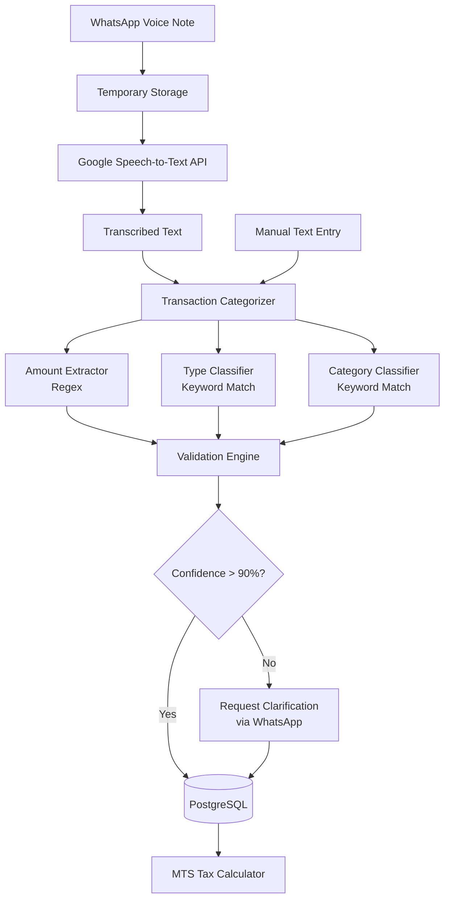

# TECHNICAL IMPLEMENTATION GUIDE #5 — AI/ML MODELS FOR TAX AUTOMATION

## 1. System Overview
**Goal**: Automate transaction categorization, business classification, and voice-to-text processing using practical ML approaches.

**Tech Stack**:
- **Voice-to-Text**: Google Cloud Speech-to-Text API
- **NLP**: Natural Language Toolkit (compromise.js for JavaScript)
- **Text Processing**: Regular expressions + keyword matching
- **Database**: PostgreSQL
- **Backend**: Node.js with Express
- **Training Data**: JSON files + PostgreSQL

---

## 2. System Architecture



---

## 3. Component 1: Voice-to-Text Engine

### 3.1 Setup Google Cloud Speech-to-Text

**Step 1: Enable API**
1. Go to Google Cloud Console
2. Create new project: "Ghana-Tax-PoC"
3. Enable "Cloud Speech-to-Text API"
4. Create service account key (JSON)
5. Download credentials file

**Step 2: Install SDK**
```bash
npm install @google-cloud/speech
```

**Step 3: Configuration**
```javascript
const speech = require('@google-cloud/speech');

// Initialize client with credentials
const client = new speech.SpeechClient({
  keyFilename: './google-cloud-credentials.json'
});
```

### 3.2 WhatsApp Audio Handler

```javascript
const axios = require('axios');
const fs = require('fs');

app.post('/webhook/whatsapp', async (req, res) => {
  const message = req.body.entry[0].changes[0].value.messages[0];
  
  if (message.type === 'audio') {
    const audioId = message.audio.id;
    const from = message.from;
    
    // Download audio from WhatsApp
    const audioUrl = await getWhatsAppMediaUrl(audioId);
    const audioBuffer = await downloadAudio(audioUrl);
    
    // Convert to text
    const transcription = await transcribeAudio(audioBuffer);
    
    // Process transaction
    const transaction = await categorizeTransaction(transcription, from);
    
    // Send confirmation
    await sendWhatsAppMessage(from, 
      `✅ Recorded: ${transaction.type} - ${transaction.category} - ${transaction.amount} GHS`
    );
  }
  
  res.sendStatus(200);
});

async function getWhatsAppMediaUrl(mediaId) {
  const response = await axios.get(
    `https://graph.facebook.com/v18.0/${mediaId}`,
    {
      headers: { 'Authorization': `Bearer ${WHATSAPP_TOKEN}` }
    }
  );
  return response.data.url;
}

async function downloadAudio(url) {
  const response = await axios.get(url, {
    responseType: 'arraybuffer',
    headers: { 'Authorization': `Bearer ${WHATSAPP_TOKEN}` }
  });
  return Buffer.from(response.data);
}
```

### 3.3 Audio Transcription

```javascript
async function transcribeAudio(audioBuffer) {
  const audio = {
    content: audioBuffer.toString('base64')
  };
  
  const config = {
    encoding: 'OGG_OPUS', // WhatsApp audio format
    sampleRateHertz: 16000,
    languageCode: 'en-GH', // Ghana English
    alternativeLanguageCodes: ['tw-GH'], // Twi support
    enableAutomaticPunctuation: true,
    model: 'default',
    useEnhanced: true
  };
  
  const request = {
    audio: audio,
    config: config
  };
  
  try {
    const [response] = await client.recognize(request);
    const transcription = response.results
      .map(result => result.alternatives[0].transcript)
      .join('\n');
    
    return transcription;
  } catch (error) {
    console.error('Transcription error:', error);
    throw new Error('Failed to transcribe audio');
  }
}
```

### 3.4 Cost Estimation
- **Pricing**: $0.006 per 15 seconds (Google Cloud Speech-to-Text)
- **Average voice note**: 10 seconds
- **Cost per transcription**: ~$0.004
- **PoC budget (1000 transactions)**: ~$4

---

## 4. Component 2: Transaction Categorization Engine

### 4.1 Database Schema

```sql
CREATE TABLE transactions (
  id SERIAL PRIMARY KEY,
  business_id INTEGER REFERENCES businesses(id),
  transaction_type VARCHAR(20), -- 'income' or 'expense'
  category VARCHAR(50),
  amount DECIMAL(10, 2),
  currency VARCHAR(3) DEFAULT 'GHS',
  description TEXT,
  confidence_score DECIMAL(3, 2),
  source VARCHAR(20), -- 'voice', 'text', 'manual'
  raw_input TEXT,
  created_at TIMESTAMP DEFAULT NOW(),
  verified BOOLEAN DEFAULT FALSE
);

CREATE INDEX idx_business_transactions ON transactions(business_id, created_at);
CREATE INDEX idx_transaction_type ON transactions(transaction_type);

CREATE TABLE transaction_categories (
  id SERIAL PRIMARY KEY,
  category_name VARCHAR(50) UNIQUE,
  category_type VARCHAR(20), -- 'income' or 'expense'
  keywords TEXT[], -- Array of keywords
  priority INTEGER DEFAULT 1
);

-- Insert predefined categories
INSERT INTO transaction_categories (category_name, category_type, keywords, priority) VALUES
  ('sales', 'income', ARRAY['sold', 'sale', 'customer paid', 'received payment'], 1),
  ('service_income', 'income', ARRAY['service', 'work done', 'job completed'], 2),
  ('supplies', 'expense', ARRAY['bought', 'purchased', 'supplies', 'materials'], 1),
  ('rent', 'expense', ARRAY['rent', 'rental'], 1),
  ('utilities', 'expense', ARRAY['electricity', 'water', 'bills', 'utilities'], 2),
  ('transport', 'expense', ARRAY['transport', 'fuel', 'petrol', 'taxi'], 2),
  ('wages', 'expense', ARRAY['salary', 'wages', 'paid worker', 'staff'], 1);
```

### 4.2 Amount Extraction

```javascript
function extractAmount(text) {
  // Pattern 1: Numeric with currency
  const pattern1 = /(\d+(?:,\d{3})*(?:\.\d{2})?)\s*(?:cedis|GHS|GH₵|ghana cedis)/i;
  const match1 = text.match(pattern1);
  if (match1) {
    return parseFloat(match1[1].replace(/,/g, ''));
  }
  
  // Pattern 2: Just numbers
  const pattern2 = /(\d+(?:,\d{3})*(?:\.\d{2})?)/;
  const match2 = text.match(pattern2);
  if (match2) {
    return parseFloat(match2[1].replace(/,/g, ''));
  }
  
  // Pattern 3: Number words
  const numberWords = {
    'one': 1, 'two': 2, 'three': 3, 'four': 4, 'five': 5,
    'six': 6, 'seven': 7, 'eight': 8, 'nine': 9, 'ten': 10,
    'twenty': 20, 'thirty': 30, 'forty': 40, 'fifty': 50,
    'sixty': 60, 'seventy': 70, 'eighty': 80, 'ninety': 90,
    'hundred': 100, 'thousand': 1000
  };
  
  const words = text.toLowerCase().split(/\s+/);
  let total = 0;
  let current = 0;
  
  for (const word of words) {
    if (numberWords[word]) {
      const value = numberWords[word];
      if (value >= 100) {
        current = current === 0 ? value : current * value;
      } else {
        current += value;
      }
    }
  }
  
  if (current > 0) return current;
  
  return null;
}

// Test cases
console.log(extractAmount("Sold rice for 250 cedis")); // 250
console.log(extractAmount("Bought supplies 1,500 GHS")); // 1500
console.log(extractAmount("Received two hundred cedis")); // 200
```

### 4.3 Transaction Type Classification

```javascript
async function classifyTransactionType(text) {
  const lowerText = text.toLowerCase();
  
  // Income keywords
  const incomeKeywords = [
    'sold', 'sale', 'customer paid', 'received', 'earned', 
    'income', 'payment received', 'got paid', 'collected'
  ];
  
  // Expense keywords
  const expenseKeywords = [
    'bought', 'purchased', 'paid', 'spent', 'cost', 
    'expense', 'bill', 'payment made', 'gave'
  ];
  
  let incomeScore = 0;
  let expenseScore = 0;
  
  for (const keyword of incomeKeywords) {
    if (lowerText.includes(keyword)) {
      incomeScore += 1;
    }
  }
  
  for (const keyword of expenseKeywords) {
    if (lowerText.includes(keyword)) {
      expenseScore += 1;
    }
  }
  
  if (incomeScore > expenseScore) {
    return { type: 'income', confidence: 0.95 };
  } else if (expenseScore > incomeScore) {
    return { type: 'expense', confidence: 0.95 };
  } else {
    return { type: 'unknown', confidence: 0.3 };
  }
}
```

### 4.4 Category Classification

```javascript
async function classifyCategory(text, transactionType) {
  // Fetch categories from database
  const categories = await db.query(`
    SELECT category_name, keywords, priority
    FROM transaction_categories
    WHERE category_type = $1
    ORDER BY priority ASC
  `, [transactionType]);
  
  const lowerText = text.toLowerCase();
  let matches = [];
  
  for (const cat of categories.rows) {
    for (const keyword of cat.keywords) {
      if (lowerText.includes(keyword)) {
        matches.push({
          category: cat.category_name,
          priority: cat.priority,
          keyword: keyword
        });
        break; // Only count once per category
      }
    }
  }
  
  if (matches.length === 0) {
    return { category: 'other', confidence: 0.3, keyword: null };
  }
  
  // Return highest priority match
  matches.sort((a, b) => a.priority - b.priority);
  return {
    category: matches[0].category,
    confidence: 0.85,
    keyword: matches[0].keyword
  };
}
```

### 4.5 Complete Categorization Pipeline

```javascript
async function categorizeTransaction(text, phoneNumber) {
  // Get business ID
  const business = await db.query(
    'SELECT id FROM businesses WHERE phone_international = $1',
    [phoneNumber]
  );
  
  if (business.rows.length === 0) {
    throw new Error('Business not found');
  }
  
  const businessId = business.rows[0].id;
  
  // Extract amount
  const amount = extractAmount(text);
  
  // Classify type
  const typeResult = await classifyTransactionType(text);
  
  // Classify category
  let categoryResult = { category: 'other', confidence: 0.3 };
  if (typeResult.type !== 'unknown') {
    categoryResult = await classifyCategory(text, typeResult.type);
  }
  
  // Calculate overall confidence
  const overallConfidence = Math.min(
    typeResult.confidence,
    categoryResult.confidence,
    amount ? 1.0 : 0.5
  );
  
  // If confidence is low, return for manual verification
  if (overallConfidence < 0.9 || !amount) {
    return {
      needsClarification: true,
      type: typeResult.type,
      category: categoryResult.category,
      amount: amount,
      confidence: overallConfidence,
      rawInput: text
    };
  }
  
  // Save to database
  const result = await db.query(`
    INSERT INTO transactions 
    (business_id, transaction_type, category, amount, description, 
     confidence_score, source, raw_input, verified)
    VALUES ($1, $2, $3, $4, $5, $6, $7, $8, $9)
    RETURNING id
  `, [
    businessId,
    typeResult.type,
    categoryResult.category,
    amount,
    text,
    overallConfidence,
    'voice',
    text,
    overallConfidence >= 0.95
  ]);
  
  return {
    id: result.rows[0].id,
    type: typeResult.type,
    category: categoryResult.category,
    amount: amount,
    confidence: overallConfidence,
    needsClarification: false
  };
}
```

### 4.6 Clarification Flow

```javascript
async function handleClarification(transaction, phoneNumber) {
  if (!transaction.amount) {
    await sendWhatsAppMessage(phoneNumber,
      `I detected a ${transaction.type} but couldn't find the amount. ` +
      `Please reply with just the amount in cedis.`
    );
    
    // Store pending transaction
    await db.query(`
      INSERT INTO pending_clarifications 
      (phone, transaction_data, clarification_type)
      VALUES ($1, $2, $3)
    `, [phoneNumber, JSON.stringify(transaction), 'amount']);
  } else if (transaction.type === 'unknown') {
    await sendWhatsAppMessage(phoneNumber,
      `I couldn't determine if this is income or expense. ` +
      `Reply with:\n1 for Income\n2 for Expense`
    );
    
    await db.query(`
      INSERT INTO pending_clarifications 
      (phone, transaction_data, clarification_type)
      VALUES ($1, $2, $3)
    `, [phoneNumber, JSON.stringify(transaction), 'type']);
  }
}

// Handle clarification responses
app.post('/webhook/whatsapp', async (req, res) => {
  const message = req.body.entry[0].changes[0].value.messages[0];
  
  if (message.type === 'text') {
    const text = message.text.body;
    const from = message.from;
    
    // Check for pending clarification
    const pending = await db.query(`
      SELECT * FROM pending_clarifications
      WHERE phone = $1
      ORDER BY created_at DESC
      LIMIT 1
    `, [from]);
    
    if (pending.rows.length > 0) {
      const clarification = pending.rows[0];
      const transactionData = JSON.parse(clarification.transaction_data);
      
      if (clarification.clarification_type === 'amount') {
        const amount = extractAmount(text);
        if (amount) {
          transactionData.amount = amount;
          await saveTransaction(transactionData, from);
          await sendWhatsAppMessage(from, 
            `✅ Recorded: ${transactionData.type} - ${transactionData.category} - ${amount} GHS`
          );
          
          // Delete pending clarification
          await db.query('DELETE FROM pending_clarifications WHERE id = $1', 
            [clarification.id]);
        }
      } else if (clarification.clarification_type === 'type') {
        if (text === '1') {
          transactionData.type = 'income';
        } else if (text === '2') {
          transactionData.type = 'expense';
        }
        
        await saveTransaction(transactionData, from);
        await sendWhatsAppMessage(from, 
          `✅ Recorded: ${transactionData.type} - ${transactionData.amount} GHS`
        );
        
        await db.query('DELETE FROM pending_clarifications WHERE id = $1', 
          [clarification.id]);
      }
    } else {
      // Regular transaction processing
      const transaction = await categorizeTransaction(text, from);
      
      if (transaction.needsClarification) {
        await handleClarification(transaction, from);
      } else {
        await sendWhatsAppMessage(from, 
          `✅ Recorded: ${transaction.type} - ${transaction.category} - ${transaction.amount} GHS`
        );
      }
    }
  }
  
  res.sendStatus(200);
});
```

---

## 5. Component 3: Business Type Classifier

### 5.1 Classification Logic (Same as OSINT)

```javascript
const businessCategories = {
  'hairdressing': {
    keywords: ['hair', 'salon', 'beauty', 'barber', 'braiding', 'weave', 'stylist'],
    priority: 1
  },
  'food_services': {
    keywords: ['chop bar', 'restaurant', 'food', 'catering', 'eatery', 'kitchen', 'cook'],
    priority: 1
  },
  'tailoring': {
    keywords: ['tailor', 'sewing', 'fashion', 'dressmaking', 'seamstress', 'clothing'],
    priority: 1
  },
  'electronics_repair': {
    keywords: ['phone repair', 'electronics', 'laptop', 'computer', 'technician', 'mobile'],
    priority: 2
  },
  'transport': {
    keywords: ['taxi', 'driver', 'transport', 'delivery', 'uber', 'bolt', 'okada'],
    priority: 2
  },
  'retail': {
    keywords: ['shop', 'store', 'provisions', 'supermarket', 'boutique', 'selling'],
    priority: 3
  }
};

function classifyBusiness(description) {
  const text = description.toLowerCase();
  let matches = [];
  
  for (const [type, config] of Object.entries(businessCategories)) {
    for (const keyword of config.keywords) {
      if (text.includes(keyword)) {
        matches.push({ type, priority: config.priority, keyword });
        break;
      }
    }
  }
  
  if (matches.length === 0) {
    return { type: 'other', confidence: 0.3, keyword: null };
  }
  
  matches.sort((a, b) => a.priority - b.priority);
  return {
    type: matches[0].type,
    confidence: 0.85,
    keyword: matches[0].keyword
  };
}
```

---

## 6. Training Data Generation

### 6.1 Synthetic Data Generator

```javascript
const syntheticTransactions = [
  // Income examples
  { text: "Sold 5 bags of rice for 250 cedis", type: "income", amount: 250, category: "sales" },
  { text: "Customer paid 120 for haircut", type: "income", amount: 120, category: "sales" },
  { text: "Received payment 500 GHS for catering", type: "income", amount: 500, category: "service_income" },
  { text: "Got paid 80 cedis for sewing dress", type: "income", amount: 80, category: "service_income" },
  { text: "Sold phone case for 30", type: "income", amount: 30, category: "sales" },
  
  // Expense examples
  { text: "Bought flour 80 cedis", type: "expense", amount: 80, category: "supplies" },
  { text: "Paid rent 500", type: "expense", amount: 500, category: "rent" },
  { text: "Spent 150 on electricity bill", type: "expense", amount: 150, category: "utilities" },
  { text: "Purchased materials 200 GHS", type: "expense", amount: 200, category: "supplies" },
  { text: "Paid worker 100 cedis", type: "expense", amount: 100, category: "wages" },
  { text: "Transport cost 25", type: "expense", amount: 25, category: "transport" },
  { text: "Bought fuel 60 cedis", type: "expense", amount: 60, category: "transport" }
];

async function generateTrainingData() {
  for (const example of syntheticTransactions) {
    await db.query(`
      INSERT INTO training_data (text, transaction_type, amount, category)
      VALUES ($1, $2, $3, $4)
    `, [example.text, example.type, example.amount, example.category]);
  }
  
  console.log(`Generated ${syntheticTransactions.length} training examples`);
}
```

### 6.2 Collect Real User Data

```javascript
// After each successful transaction, optionally add to training data
async function addToTrainingData(transaction) {
  if (transaction.verified && transaction.confidence_score >= 0.95) {
    await db.query(`
      INSERT INTO training_data (text, transaction_type, amount, category, source)
      VALUES ($1, $2, $3, $4, 'user')
    `, [
      transaction.raw_input,
      transaction.transaction_type,
      transaction.amount,
      transaction.category
    ]);
  }
}
```

---

## 7. Performance Metrics & Testing

### 7.1 Test Suite

```javascript
const testCases = [
  { input: "Sold 3 bags of rice for 250 cedis", expected: { type: "income", amount: 250, category: "sales" } },
  { input: "Bought supplies 100 cedis", expected: { type: "expense", amount: 100, category: "supplies" } },
  { input: "Customer paid 75", expected: { type: "income", amount: 75, category: "sales" } },
  { input: "Paid rent 500 GHS", expected: { type: "expense", amount: 500, category: "rent" } },
  { input: "Received two hundred cedis for haircut", expected: { type: "income", amount: 200, category: "sales" } }
];

async function runTests() {
  let correct = 0;
  let total = testCases.length;
  
  for (const test of testCases) {
    const result = await categorizeTransaction(test.input, '+233244000000');
    
    const isCorrect = 
      result.type === test.expected.type &&
      result.amount === test.expected.amount &&
      result.category === test.expected.category;
    
    if (isCorrect) correct++;
    
    console.log(`Test: "${test.input}"`);
    console.log(`Expected: ${JSON.stringify(test.expected)}`);
    console.log(`Got: ${JSON.stringify(result)}`);
    console.log(`Result: ${isCorrect ? '✅ PASS' : '❌ FAIL'}\n`);
  }
  
  const accuracy = (correct / total * 100).toFixed(2);
  console.log(`Accuracy: ${accuracy}% (${correct}/${total})`);
}
```

### 7.2 Metrics Dashboard

```javascript
app.get('/api/metrics/ml', async (req, res) => {
  // Transaction categorization accuracy
  const accuracy = await db.query(`
    SELECT 
      COUNT(*) FILTER (WHERE verified = true) as verified_count,
      COUNT(*) as total_count,
      AVG(confidence_score) as avg_confidence
    FROM transactions
    WHERE created_at > NOW() - INTERVAL '7 days'
  `);
  
  // Voice-to-text usage
  const voiceUsage = await db.query(`
    SELECT COUNT(*) as voice_count
    FROM transactions
    WHERE source = 'voice'
      AND created_at > NOW() - INTERVAL '7 days'
  `);
  
  // Category distribution
  const categoryDist = await db.query(`
    SELECT category, COUNT(*) as count
    FROM transactions
    WHERE created_at > NOW() - INTERVAL '7 days'
    GROUP BY category
    ORDER BY count DESC
  `);
  
  res.json({
    accuracy: {
      verified: accuracy.rows[0].verified_count,
      total: accuracy.rows[0].total_count,
      percentage: (accuracy.rows[0].verified_count / accuracy.rows[0].total_count * 100).toFixed(2),
      avg_confidence: parseFloat(accuracy.rows[0].avg_confidence).toFixed(2)
    },
    voice_usage: voiceUsage.rows[0].voice_count,
    category_distribution: categoryDist.rows
  });
});
```

---

## 8. Error Handling & Fallbacks

### 8.1 Google API Failure

```javascript
async function transcribeAudioWithFallback(audioBuffer) {
  try {
    return await transcribeAudio(audioBuffer);
  } catch (error) {
    console.error('Google API failed:', error);
    
    // Fallback: Ask user to type manually
    await sendWhatsAppMessage(phoneNumber,
      '⚠️ Voice processing failed. Please type your transaction instead.'
    );
    
    return null;
  }
}
```

### 8.2 Low Confidence Handling

```javascript
async function handleLowConfidence(transaction, phoneNumber) {
  await sendWhatsAppMessage(phoneNumber,
    `I recorded this transaction but please verify:\n\n` +
    `Type: ${transaction.type}\n` +
    `Category: ${transaction.category}\n` +
    `Amount: ${transaction.amount} GHS\n\n` +
    `Reply YES to confirm or provide corrections.`
  );
  
  // Mark as unverified
  await db.query(`
    UPDATE transactions
    SET verified = false
    WHERE id = $1
  `, [transaction.id]);
}
```

---

## 9. Privacy & Security

### 9.1 Data Retention Policy

```javascript
// Delete voice recordings after transcription
async function cleanupVoiceData() {
  // Voice files are never stored - only processed in memory
  // Transcriptions are kept for 90 days
  
  await db.query(`
    DELETE FROM transactions
    WHERE source = 'voice'
      AND created_at < NOW() - INTERVAL '90 days'
      AND verified = true
  `);
}

// Run daily
const cron = require('node-cron');
cron.schedule('0 2 * * *', cleanupVoiceData); // 2 AM daily
```

### 9.2 Encryption

```javascript
const crypto = require('crypto');

function encryptSensitiveData(text) {
  const algorithm = 'aes-256-cbc';
  const key = Buffer.from(process.env.ENCRYPTION_KEY, 'hex');
  const iv = crypto.randomBytes(16);
  
  const cipher = crypto.createCipheriv(algorithm, key, iv);
  let encrypted = cipher.update(text, 'utf8', 'hex');
  encrypted += cipher.final('hex');
  
  return iv.toString('hex') + ':' + encrypted;
}

function decryptSensitiveData(encryptedText) {
  const algorithm = 'aes-256-cbc';
  const key = Buffer.from(process.env.ENCRYPTION_KEY, 'hex');
  
  const parts = encryptedText.split(':');
  const iv = Buffer.from(parts[0], 'hex');
  const encrypted = parts[1];
  
  const decipher = crypto.createDecipheriv(algorithm, key, iv);
  let decrypted = decipher.update(encrypted, 'hex', 'utf8');
  decrypted += decipher.final('utf8');
  
  return decrypted;
}
```

---

## 10. Deployment Checklist

- [ ] Create Google Cloud project and enable Speech-to-Text API
- [ ] Download service account credentials
- [ ] Set up PostgreSQL database with transaction tables
- [ ] Install Node.js dependencies (@google-cloud/speech)
- [ ] Configure environment variables (API keys, encryption keys)
- [ ] Generate synthetic training data (200+ examples)
- [ ] Test voice-to-text with sample audio files
- [ ] Test transaction categorization with test suite
- [ ] Set up WhatsApp webhook handlers
- [ ] Configure error handling and fallbacks
- [ ] Set up metrics dashboard
- [ ] Deploy to cloud (AWS/GCP/Heroku)
- [ ] Monitor API usage and costs
- [ ] Test end-to-end flow with pilot users

---

## 11. Cost Analysis

### 11.1 Google Cloud Speech-to-Text
- **Standard pricing**: $0.006 per 15 seconds
- **Enhanced pricing**: $0.009 per 15 seconds
- **Average voice note**: 10 seconds = $0.004
- **PoC estimate (1000 transactions)**: $4

### 11.2 Total ML Costs for PoC
- Voice-to-text: $4
- Hosting (AWS t3.small): $15/month
- Database (PostgreSQL): $10/month
- **Total**: ~$30 for PoC

---

## 12. Expected Output

**Sample Transaction Record**:
```json
{
  "id": 1,
  "business_id": 5,
  "transaction_type": "income",
  "category": "sales",
  "amount": 250.00,
  "currency": "GHS",
  "description": "Sold 5 bags of rice for 250 cedis",
  "confidence_score": 0.95,
  "source": "voice",
  "raw_input": "Sold 5 bags of rice for 250 cedis",
  "created_at": "2025-11-19T14:30:00Z",
  "verified": true
}
```

**Metrics Target**:
- Transaction categorization accuracy: ≥95%
- Voice-to-text accuracy: ≥90%
- Processing time: <2 seconds per transaction
- Clarification rate: <10% of transactions
