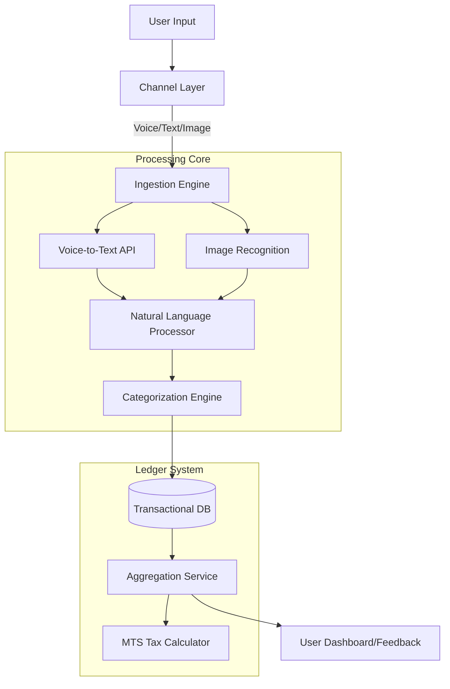

# TECHNICAL IMPLEMENTATION GUIDE #6 — AI-ASSISTED BOOKKEEPING & LEDGER SYSTEM

## 1. System Overview
**Goal**: Transform unstructured inputs (WhatsApp voice notes, text messages, images, USSD codes) into a structured, double-entry standard ledger system without requiring users to understand accounting principles.

**Tech Stack**:
- **Voice Processing**: Google Cloud Speech-to-Text API
- **NLP/Text Processing**: spaCy + custom rule engine
- **OCR**: Azure Vision API / Google Cloud Vision
- **Backend**: Node.js with Express
- **Database**: PostgreSQL (ledger + audit trail)
- **Message Queue**: Bull (Redis-based)
- **Real-time**: Redis for caching daily summaries

---

## 2. Data Pipeline Architecture



---

## 3. Input Methods

### 3.1 Method 1: Conversational Voice (Primary)

**User Action**: Sends a WhatsApp voice note in Twi, Ga, or English.

**Example**: 
- Twi: "Me tɔn rice 5 bags, 250 cedis." (I sold 5 bags of rice for 250 cedis)
- English: "I sold three bags for two hundred fifty"

**Tech Stack**: 
```javascript
// Google Speech-to-Text configuration
const speechConfig = {
  encoding: 'OGG_OPUS',
  sampleRateHertz: 16000,
  languageCode: 'en-GH',
  alternativeLanguageCodes: ['tw-GH', 'gaa-GH'], // Twi, Ga support
  enableAutomaticPunctuation: true,
  model: 'default'
};
```

**Processing Flow**:
1. Receive WhatsApp voice note (OGG format)
2. Send to Google Speech-to-Text API
3. Get transcription: "I sold five bags rice 250 cedis"
4. Pass to NLP engine

---

### 3.2 Method 2: Unstructured Text

**User Action**: Types a short message.

**Examples**:
- "Transport 20ghs"
- "Sales 500"
- "Bought stock 150 cedis"

**Logic**: Regex parsing for:
- Currency patterns: `GHS`, `cedis`, `₵`
- Keywords: Transport, Sales, Stock, Rent
- Amounts: Numbers + currency

**Implementation**:
```javascript
const extractors = {
  amount: /(\d+(?:,\d{3})*(?:\.\d{2})?)\s*(?:GHS|cedis|₵)?/gi,
  keywords: {
    income: ['sold', 'sale', 'sales', 'received', 'paid me'],
    expense: ['bought', 'transport', 'rent', 'stock', 'paid']
  }
};
```

---

### 3.3 Method 3: USSD Numeric Entry (Fallback)

**User Action**: Dials shortcode (e.g., `*920*404#`)

**Flow**:
```
*920*404#
  ↓
1. Income | 2. Expense
  ↓ (User selects 1)
Enter Amount: 50
  ↓
1. Sales | 2. Service | 3. Other
  ↓ (User selects 1)
✓ Recorded: Income - Sales - 50 GHS
```

**Database Structure**:
```javascript
{
  type: 'INCOME',
  category: 'Sales',
  amount: 50,
  source: 'USSD',
  confidence: 1.0 // USSD is explicit
}
```

---

### 3.4 Method 4: Image/Media (Receipts)

**User Action**: Uploads a photo of supplier invoice or hand-written notebook.

**Tech Stack**: Azure Vision API / Google Cloud Vision (OCR)

**Processing Logic**:
1. Extract text from image
2. Parse for:
   - Date patterns
   - Total amount
   - Vendor name
   - Item descriptions

**Example OCR Output**:
```json
{
  "vendor": "Makola Wholesale",
  "date": "2025-11-15",
  "items": [
    {"description": "Rice - 5 bags", "amount": 250}
  ],
  "total": 250
}
```

**Confidence Scoring**:
- Clear printed receipt: 0.9
- Handwritten note: 0.6
- Blurry image: 0.4

---

### 3.5 Method 5: WhatsApp Flows (Structured Forms)

**User Action**: Opens a form inside WhatsApp for detailed transaction entry.

**Use Cases**:
1. **Bulk Entry**: Record multiple transactions at once
2. **Detailed Invoices**: Itemized expenses with quantities
3. **Weekly Reconciliation**: Review and confirm transactions
4. **Inventory Updates**: Stock purchases with detailed breakdown

**Tech Stack**: WhatsApp Flows API (JSON-based forms)

**Example Flow - Daily Batch Entry**:
```json
{
  "version": "3.0",
  "screens": [
    {
      "id": "TRANSACTIONS",
      "title": "Record Today's Transactions",
      "layout": {
        "type": "SingleColumnLayout",
        "children": [
          {
            "type": "Form",
            "name": "transaction_form",
            "children": [
              {
                "type": "TextInput",
                "name": "total_sales",
                "label": "Total Sales (GHS)",
                "input-type": "number",
                "required": true
              },
              {
                "type": "Dropdown",
                "name": "expense_1_category",
                "label": "First Expense Category",
                "data-source": [
                  {"id": "transport", "title": "Transport"},
                  {"id": "rent", "title": "Rent"},
                  {"id": "inventory", "title": "Inventory"},
                  {"id": "utilities", "title": "Utilities"}
                ]
              },
              {
                "type": "TextInput",
                "name": "expense_1_amount",
                "label": "Amount (GHS)",
                "input-type": "number"
              },
              {
                "type": "TextArea",
                "name": "notes",
                "label": "Additional Notes (Optional)"
              },
              {
                "type": "Footer",
                "label": "Submit",
                "on-click-action": {
                  "name": "complete",
                  "payload": {}
                }
              }
            ]
          }
        ]
      }
    }
  ]
}
```

**Processing Flow Response**:
```javascript
app.post('/webhook/whatsapp-flow', async (req, res) => {
  const flowResponse = req.body.flow_token;
  const data = JSON.parse(flowResponse);
  
  const transactions = [];
  
  // Create income transaction
  if (data.total_sales) {
    transactions.push({
      type: 'INCOME',
      category: 'Sales',
      amount: parseFloat(data.total_sales),
      source: 'WhatsApp Flow',
      confidence_score: 1.0, // Structured input = high confidence
      verification_status: 'AUTO_VERIFIED'
    });
  }
  
  // Create expense transactions
  if (data.expense_1_amount) {
    transactions.push({
      type: 'EXPENSE',
      category: data.expense_1_category,
      amount: parseFloat(data.expense_1_amount),
      source: 'WhatsApp Flow',
      confidence_score: 1.0
    });
  }
  
  // Batch insert
  await saveTransactionsBatch(userId, transactions);
  
  // Send confirmation
  await sendWhatsAppMessage(userId, {
    text: `✅ Recorded ${transactions.length} transactions!\n\nIncome: GHS ${data.total_sales}\nExpenses: GHS ${data.expense_1_amount}`
  });
});
```

**Advanced Flow - Itemized Invoice Entry**:
```json
{
  "screens": [
    {
      "id": "INVOICE",
      "title": "Record Purchase Invoice",
      "layout": {
        "children": [
          {
            "type": "DatePicker",
            "name": "invoice_date",
            "label": "Invoice Date"
          },
          {
            "type": "TextInput",
            "name": "vendor_name",
            "label": "Vendor/Supplier Name"
          },
          {
            "type": "TextInput",
            "name": "item_1_name",
            "label": "Item 1"
          },
          {
            "type": "TextInput",
            "name": "item_1_quantity",
            "label": "Quantity",
            "input-type": "number"
          },
          {
            "type": "TextInput",
            "name": "item_1_price",
            "label": "Unit Price",
            "input-type": "number"
          },
          {
            "type": "OptIn",
            "name": "add_to_inventory",
            "label": "Add to inventory tracking"
          }
        ]
      }
    }
  ]
}
```

**When to Trigger Flows**:
1. **User Request**: "I want to enter multiple transactions"
2. **Weekly Prompt**: Automated message on Fridays
3. **After Threshold**: When user sends 5+ transactions in a day
4. **Complex Scenarios**: Receipt with multiple line items

**Advantages**:
- ✅ Structured data (100% confidence)
- ✅ No NLP parsing needed
- ✅ Faster bulk entry
- ✅ Pre-validated inputs (dropdowns prevent errors)
- ✅ Better UX for power users

**Flow Trigger Example**:
```javascript
async function sendBatchEntryFlow(userId) {
  await sendWhatsAppMessage(userId, {
    text: "Need to record multiple transactions? Use our quick form:",
    action: {
      name: "flow",
      parameters: {
        flow_id: "BATCH_TRANSACTIONS",
        flow_cta: "Open Form",
        flow_action: "navigate",
        flow_action_payload: {
          screen: "TRANSACTIONS"
        }
      }
    }
  });
}
```

---

## 4. Ledger Schema Design

### 4.1 Database Schema

**Table: `transactions`**
```sql
CREATE TABLE transactions (
  transaction_id UUID PRIMARY KEY DEFAULT uuid_generate_v4(),
  user_id UUID NOT NULL REFERENCES users(id),
  timestamp TIMESTAMP DEFAULT NOW(),
  raw_input TEXT,
  type VARCHAR(20) CHECK (type IN ('INCOME', 'EXPENSE')),
  category VARCHAR(100),
  amount DECIMAL(12, 2) NOT NULL,
  confidence_score DECIMAL(3, 2),
  verification_status VARCHAR(20) DEFAULT 'AUTO_VERIFIED',
  source VARCHAR(20),
  metadata JSONB,
  created_at TIMESTAMP DEFAULT NOW(),
  updated_at TIMESTAMP DEFAULT NOW()
);

CREATE INDEX idx_user_date ON transactions(user_id, timestamp);
CREATE INDEX idx_verification ON transactions(verification_status);
```

**Field Descriptions**:
| Field | Type | Description |
|-------|------|-------------|
| transaction_id | UUID | Unique identifier |
| user_id | UUID | Links to Taxpayer Profile |
| timestamp | DateTime | Time of transaction |
| raw_input | String | Original text/transcription (for audit) |
| type | Enum | INCOME or EXPENSE |
| category | String | e.g., Inventory, Transport, Utilities, Sales |
| amount | Decimal | Transaction value |
| confidence_score | Float | AI certainty (0.0 - 1.0) |
| verification_status | Enum | AUTO_VERIFIED, USER_CONFIRMED, FLAGGED |
| source | String | WhatsApp, USSD, SMS |

---

## 5. Categorization Engine

### 5.1 Categorization Heuristics

**Three-Layer Approach**:

**Layer 1: Keyword Match (Fastest)**
```javascript
const categoryRules = {
  'Transport & Logistics': ['fuel', 'petrol', 'trotro', 'taxi', 'transport'],
  'Utilities': ['airtime', 'data', 'electricity', 'water'],
  'Inventory (COGS)': ['stock', 'goods', 'restock', 'supplies'],
  'Rent/Lease': ['rent', 'lease', 'shop rent'],
  'Sales': ['sold', 'sale', 'customer paid'],
  'Repairs & Maintenance': ['fixing', 'repair', 'maintenance']
};

function matchCategory(text) {
  const lowerText = text.toLowerCase();
  
  for (const [category, keywords] of Object.entries(categoryRules)) {
    if (keywords.some(kw => lowerText.includes(kw))) {
      return { category, confidence: 0.85 };
    }
  }
  
  return { category: 'Other', confidence: 0.3 };
}
```

**Layer 2: Contextual Inference (AI)**
```javascript
// Using spaCy NLP for entity extraction
const nlp = require('compromise');

function inferCategory(text) {
  const doc = nlp(text);
  
  // Extract entities
  const people = doc.people().out('array');
  const money = doc.money().out('array');
  
  // Examples:
  // "Madam Beatrice paid me balance" 
  //   → people: ['Madam Beatrice'] 
  //   → category: Accounts Receivable / Income
  
  // "Fixing the sewing machine"
  //   → verb: 'fixing'
  //   → category: Repairs & Maintenance
  
  return categorizeByContext(doc);
}
```

**Layer 3: Anomaly Detection (Risk Engine)**
```javascript
function detectAnomaly(userId, category, businessType) {
  // Example: Barber records "Fertilizer" expense
  const businessCategories = getUserBusinessType(userId);
  
  if (businessType === 'Hairdressing' && category.includes('Fertilizer')) {
    return {
      anomaly: true,
      flagForReview: true,
      reason: 'Mismatch: business type vs. expense category'
    };
  }
  
  return { anomaly: false };
}
```

---

## 6. Detailed Workflows

### 6.1 Income Recording Flow

**Input**: User sends "Made 300 cedis today" via WhatsApp.

**Processing Steps**:
```javascript
async function processIncomeMessage(message) {
  // Step 1: Extract data
  const extracted = {
    amount: extractAmount(message), // 300
    intent: classifyIntent(message), // INCOME
    date: new Date(),
    raw: message
  };
  
  // Step 2: Confirm with user
  await sendWhatsAppMessage(userId, {
    text: "✅ Recorded: Sales Income of GHS 300. Is this correct?",
    buttons: [
      { id: 'confirm', title: 'Yes' },
      { id: 'edit', title: 'Edit' },
      { id: 'cancel', title: 'Cancel' }
    ]
  });
  
  // Step 3: Wait for confirmation
  const response = await waitForUserResponse(userId, 60000); // 60s timeout
  
  if (response.buttonId === 'confirm') {
    // Step 4: Commit to database
    await saveTransaction({
      userId,
      type: 'INCOME',
      category: 'Sales',
      amount: 300,
      raw_input: message,
      confidence_score: 0.9,
      verification_status: 'USER_CONFIRMED'
    });
    
    // Step 5: Update MTS tax liability
    await updateMTSTaxLiability(userId);
    
    return { success: true };
  }
}
```

---

### 6.2 Expense Recording Flow

**Input**: User sends "Paid shop rent 200"

**Processing**:
```javascript
async function processExpenseMessage(message) {
  const extracted = {
    amount: 200,
    intent: 'EXPENSE',
    category: 'Rent/Lease',
    confidence: 0.95
  };
  
  // Save to DB
  await saveTransaction(userId, extracted);
  
  // Run insight check
  const insights = await checkExpenseInsights(userId, extracted);
  
  if (insights.highRentWarning) {
    await sendWhatsAppMessage(userId, 
      "💡 Note: Your rent is 50% of your income this month."
    );
  }
}
```

---

## 7. Output & Value Generation

### 7.1 Daily "Cash-Up" Report

**Scheduled Job** (runs at 6:00 PM daily):
```javascript
const cron = require('node-cron');

cron.schedule('0 18 * * *', async () => {
  const users = await getActiveUsers();
  
  for (const user of users) {
    const summary = await generateDailySummary(user.id);
    
    await sendWhatsAppMessage(user.phone, {
      text: `📊 Daily Summary\n\nSold: GHS ${summary.income}\nSpent: GHS ${summary.expenses}\nProfit: GHS ${summary.profit}\n\n✨ Great job! You are ${summary.growthPercent}% above yesterday.`
    });
  }
});
```

**Database Query**:
```sql
SELECT 
  SUM(CASE WHEN type = 'INCOME' THEN amount ELSE 0 END) as total_income,
  SUM(CASE WHEN type = 'EXPENSE' THEN amount ELSE 0 END) as total_expenses,
  SUM(CASE WHEN type = 'INCOME' THEN amount ELSE -amount END) as profit
FROM transactions
WHERE user_id = $1 
  AND DATE(timestamp) = CURRENT_DATE;
```

---

### 7.2 Creditworthiness Profile

**Generate PDF Report**:
```javascript
const PDFDocument = require('pdfkit');

async function generateCreditReport(userId) {
  const doc = new PDFDocument();
  
  // Fetch 3-month summary
  const summary = await getQuarterlySummary(userId);
  
  doc.fontSize(16).text('Bookkeeping Report', { align: 'center' });
  doc.fontSize(12).text(`Business: ${summary.businessName}`);
  doc.text(`Average Monthly Income: GHS ${summary.avgIncome}`);
  doc.text(`Average Monthly Expenses: GHS ${summary.avgExpenses}`);
  doc.text(`Net Profit Margin: ${summary.profitMargin}%`);
  
  // Save to cloud storage
  const pdfPath = await savePDF(doc, userId);
  
  // Send download link to user
  await sendWhatsAppMessage(userId, {
    text: "📄 Your business report is ready!",
    document: pdfPath
  });
}
```

---

## 8. Integration with Tax Filing (MTS)

### 8.1 Monthly Aggregation

**SQL Query**:
```sql
SELECT 
  DATE_TRUNC('month', timestamp) as month,
  SUM(CASE WHEN type = 'INCOME' THEN amount ELSE 0 END) as monthly_turnover
FROM transactions
WHERE user_id = $1
  AND verification_status IN ('AUTO_VERIFIED', 'USER_CONFIRMED')
GROUP BY DATE_TRUNC('month', timestamp)
ORDER BY month DESC;
```

---

### 8.2 MTS Tax Calculation

```javascript
function calculateMTS(monthlyTurnover) {
  const MTSRate = 0.03; // 3% rate
  const flatRateThreshold = 10000; // GHS
  
  if (monthlyTurnover <= flatRateThreshold) {
    return 30; // Flat rate
  } else {
    return monthlyTurnover * MTSRate;
  }
}
```

---

### 8.3 Pre-filling Filing Form

**When user initiates filing**:
```javascript
async function initiateFiling(userId, month) {
  const turnover = await getMonthlyTurnover(userId, month);
  const tax = calculateMTS(turnover);
  
  await sendWhatsAppMessage(userId, {
    text: `📋 Filing for ${month}\n\nTotal Turnover: GHS ${turnover}\nMTS Tax: GHS ${tax}\n\nTap to confirm and submit.`,
    buttons: [
      { id: 'confirm', title: 'Confirm & Submit' },
      { id: 'edit', title: 'Edit Amount' }
    ]
  });
}
```

---

## 9. Offline & Low-Connectivity Strategy

### 9.1 USSD Buffering
```javascript
// Redis queue for offline entries
const queueOfflineTransaction = async (transaction) => {
  await redis.lpush('offline_queue', JSON.stringify(transaction));
};

// Sync when connection returns
cron.schedule('*/5 * * * *', async () => {
  const pending = await redis.lrange('offline_queue', 0, -1);
  
  for (const item of pending) {
    await saveTransaction(JSON.parse(item));
    await redis.lrem('offline_queue', 1, item);
  }
});
```

---

## 10. Implementation Timeline

| Week | Deliverable |
|------|-------------|
| 1 | Define keyword dictionaries for Twi, Ga, Ewe, English |
| 2 | Integrate Speech-to-Text API and test accent recognition |
| 3 | Build Transaction Database and Aggregation Logic |
| 4 | Develop WhatsApp response templates and Confirmation Flows |
| 5 | Pilot with 50 users (mixed business types) to train categorization |
| 6 | Full integration with MTS Tax Calculator |

---

## 11. Risks & Mitigations

| Risk | Mitigation |
|------|------------|
| Data Privacy | User financial data encrypted (AES-256), access-controlled (Tier 3) |
| Inaccurate Voice Recognition | User confirmation step before committing data |
| "GIGO" (Garbage In, Garbage Out) | Anomaly detection flags statistical deviations |
| User Fatigue | Gamification (badges for 7-day streaks), one-tap shortcuts |

---

## 12. Expected Output

**Sample Transaction Record**:
```json
{
  "transaction_id": "550e8400-e29b-41d4-a716-446655440000",
  "user_id": "123e4567-e89b-12d3-a456-426614174000",
  "timestamp": "2025-11-20T14:30:00Z",
  "raw_input": "Sold 5 bags rice 250 cedis",
  "type": "INCOME",
  "category": "Sales",
  "amount": 250.00,
  "confidence_score": 0.92,
  "verification_status": "USER_CONFIRMED",
  "source": "WhatsApp Voice"
}
```

**Daily Summary Example**:
```
📊 Daily Cash-Up
Income: GHS 450
Expenses: GHS 120
Profit: GHS 330
🎯 10% above yesterday!
```
